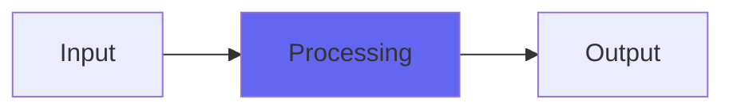

# Facet

## Quick Info

| | |
|---|---|
| **Category** | Effects |
| **Type** | Effects |
| **Status** | Latest Release |

## Description

a new kind of hard clip that adds two sharp corners into the wave

## Detailed Overview

Facet came out of me trying to come up with a new and distinct kind of distortion for the combined-distortions plugin I’m going to do. Rather than just bring Drive, Density, Spiral, Mojo etc. together, I wanted to add something different.

So, Facet adds a ‘clip point’ but rather than a hard clip it just changes the ‘knee’ of the transfer function so your peaks can still go super high, way beyond 0 dB if you like.

But, they change ‘angle’ at a sharp point which becomes sort of a corner in the sound. Except for high settings it’s both high up in the loudness, and a very gentle ‘corner’: still sharp, but very little change.

And down near zero, it’s damn near total hard clipping. At silence, it literally is a hard clip to silence.

Aw hell. Play with it, see what you think. i can’t explain this one well, at least not right now. The mad scientist labs have released another weird one. It will act like it’s a hard clip or a semi-dirty saturation, except the range of adjustment acts different, and it’ll throw an odd artifact on pure low-frequency tones… just play with it, see what you get. It will find its way into the combined plugin because it’s got a flavor all its own, but I can’t describe it today.

## Signal Flow

## How It Works

Facet processes audio in the Effects category. See the description above for specific functionality.

## Usage Tips

- Start with conservative settings
- A/B compare to hear the effect clearly
- Use in context with other processing
- Trust your ears over visual meters

## Related Plugins

Browse other [Effects](../categories/effects.md) plugins.

## Technical Details

**Source Code**: [View on GitHub](https://github.com/airwindows/airwindows/tree/master/plugins/LinuxVST/src/Facet)

**Categories**: Effects

**Available Formats**:
- Mac AU
- Mac VST
- Windows VST
- Linux VST

## Resources

- [All Airwindows Plugins](../../README.md)
- [Category: Effects](../categories/effects.md)
- [Airwindows Website](https://www.airwindows.com)
- [Airwindows GitHub](https://github.com/airwindows/airwindows)

---

*Part of the Airwindows plugin collection - Open source audio processing plugins*

*Last updated: 2024*
