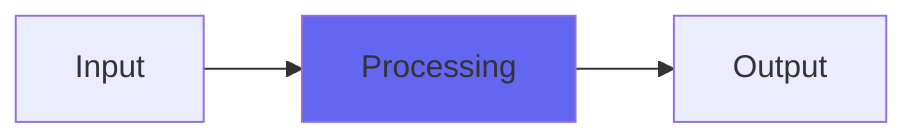

# Flutter

## Quick Info

| | |
|---|---|
| **Category** | Lo-Fi |
| **Type** | Lo-Fi |
| **Status** | Stable |

## Description

the flutter from ToTape6, standalone

## Detailed Overview

This is by request. Sometimes you want stuff to go a little unsteady and wobbly, but you don't want a full-on tape emulation with, like, dubly and everything. (you don't do heavy metal in dubly, you know.) And so, here is Flutter, standalone!

This is a tricky little algorithm, so let me give some details on what's happening here. It's not a vibrato, or even particularly random. Flutter gets its rate of waver, from the input signal coming in. This probably means that if you put a test tone in, you get a regular warble… or maybe even some awkward noise… out. The reason it does this is to react to the input waveform more directly. I realize the input waveform doesn't directly modsulate tape flutter, but this does, so there you go.

In practice, you get a flutter/warble that stays pretty subtle right up to when it doesn't. Push it far enough and you get aggressive flutter. Dial it back and it quickly becomes more well-behaved, but it's still functioning and can do a nice job of destabilizing pitch in a tapelike way. A side effect of this quirky approach is that it runs with low enough (but NOT zero) latency that you can use it on a live instrument. You can sneak it onto a delay send, or reverb send, to give yourself just a little spread and layering to what otherwise sounds digitally flat and flawless. Or you can sit it on regular tracks and just go for that very subtle mulch-tone of old school retro, and use other means to dirty the sound up.

Sometimes it's handy to be able to take something ultra-pure, like a bell or electric piano, and destabilize it without any tonal adjustment at all. Retain the chime but add that bit of drift. I hope you like Flutter.

## Signal Flow

## How It Works

Flutter processes audio in the Lo-Fi category. See the description above for specific functionality.

## Usage Tips

- Start with conservative settings
- A/B compare to hear the effect clearly
- Use in context with other processing
- Trust your ears over visual meters

## Related Plugins

Browse other [Lo-Fi](../categories/lo-fi.md) plugins.

## Technical Details

**Source Code**: [View on GitHub](https://github.com/airwindows/airwindows/tree/master/plugins/LinuxVST/src/Flutter)

**Categories**: Lo-Fi

**Available Formats**:
- Mac AU
- Mac VST
- Windows VST
- Linux VST

## Resources

- [All Airwindows Plugins](../../README.md)
- [Category: Lo-Fi](../categories/lo-fi.md)
- [Airwindows Website](https://www.airwindows.com)
- [Airwindows GitHub](https://github.com/airwindows/airwindows)

---

*Part of the Airwindows plugin collection - Open source audio processing plugins*

*Last updated: 2024*
