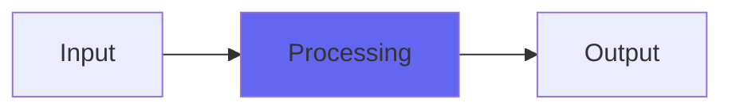

# Flutter2

 

## Quick Info

| | |
|---|---|
| **Category** | Lo-Fi |
| **Type** | Lo-Fi |
| **Status** | Latest Release |

## Description

the flutter from ToTape7, standalone

## Detailed Overview

It's time for a new ToTape (actively being worked on, and yes you're still getting more reverbs and ConsoleX and all that) and it turns out that when I went back in to revise the tape flutter algorithm, live on stream, the work went so well that I COULD NOT WAIT. I was basically looking to address how, in the original Flutter, it slows as well as becoming gentler when you turn it down, and I thought that for 2024 ToTape7 it might be worth bringing in extra controls just to give people more power over their flutter effect.

And then when I improved the algorithm and discovered that, cranked up, it does everything from shortwave radio impressions to Cookie Monsterification, that was exciting.

But not as exciting as when I learned that if you crank it way up and make the flutterspeed REALLY slow, you get a heavy guitar doubler. Suddenly, I had a really decent fake hard-panned, still weirdly tight, doubled guitar that sounded fantastic apart from occasionally (and understandably) going mono on me.

Enjoy Flutter2, it's going to be in the new ToTape7 when that's done. It means you have everything from reel-to-reel (less flutter than 0.5 for that), to cassette, to Roland Space Echo, to VHS, to cassette that's been yanked out of the shell and jumped up and down on for a bit and put back and attempted to be played.

Also, here's my tip: rather than track one guitar and try to make it two with Flutter2, have you considered tracking three guitars and trying to make it five? If you do two real doubletracks, and then one 'thickener' to put in the center, and THEN add Flutter2 to that center track and use the dry/wet control, you can very definitely mimic FIVE guitar tracks for the price of three, and if center/flutter2 is slightly quieter it won't stick out that much when Flutter starts to hint at mono occasionally, because there's meant to be a mono track. You can lean on the Flutter2 a bit harder if you want to go superwide.

Oh, which reminds me, there's also a new Srsly coming… but more on that later. Enjoy Flutter2 :)

## Signal Flow

## How It Works

Flutter2 processes audio in the Lo-Fi category. See the description above for specific functionality.

## Usage Tips

- Start with conservative settings
- A/B compare to hear the effect clearly
- Use in context with other processing
- Trust your ears over visual meters

## Related Plugins

Browse other [Lo-Fi](../categories/lo-fi.md) plugins.

## Technical Details

**Source Code**: [View on GitHub](https://github.com/airwindows/airwindows/tree/master/plugins/LinuxVST/src/Flutter2)

**Categories**: Lo-Fi

**Available Formats**:
- Mac AU
- Mac VST
- Windows VST
- Linux VST

## Resources

- [All Airwindows Plugins](../../README.md)
- [Category: Lo-Fi](../categories/lo-fi.md)
- [Airwindows Website](https://www.airwindows.com)
- [Airwindows GitHub](https://github.com/airwindows/airwindows)

---

*Part of the Airwindows plugin collection - Open source audio processing plugins*

*Last updated: 2024*
