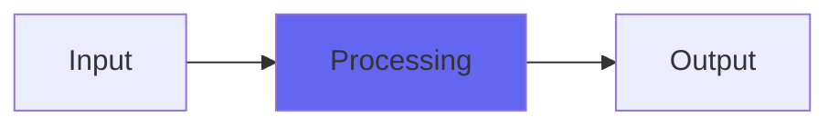

# Fracture

## Quick Info

| | |
|---|---|
| **Category** | Effects |
| **Type** | Effects |
| **Status** | Stable |

## Description

a frequency multiplier/waveshaper with a soft disruption to the sound

## Detailed Overview

Fracture is straight up a West Coast wavefolder, in a plugin. My original description doesn't help explain that too much: it is a sine-based distortion that wraps around and lets you set a maximum 'fold' which becomes a hard clip. Boost into it with Drive to do more intense wavefolding, and increase Fracture to allow you to fold more times before it just clips. This also allows you to clip either at full crank, or at silence (for a different effect). Original post was simply this:

Hi! Merry Xmas to Xmas-ers. Here’s a truly freaky little wave-shaper. It’s of interest to distortion fanciers, those who make wubs and things, and anybody who might like the digital equivalent of an insane boutique stompbox that doesn’t sound like anything else.

## Signal Flow

## How It Works

Fracture processes audio in the Effects category. See the description above for specific functionality.

## Usage Tips

- Start with conservative settings
- A/B compare to hear the effect clearly
- Use in context with other processing
- Trust your ears over visual meters

## Related Plugins

Browse other [Effects](../categories/effects.md) plugins.

## Technical Details

**Source Code**: [View on GitHub](https://github.com/airwindows/airwindows/tree/master/plugins/LinuxVST/src/Fracture)

**Categories**: Effects

**Available Formats**:
- Mac AU
- Mac VST
- Windows VST
- Linux VST

## Resources

- [All Airwindows Plugins](../../README.md)
- [Category: Effects](../categories/effects.md)
- [Airwindows Website](https://www.airwindows.com)
- [Airwindows GitHub](https://github.com/airwindows/airwindows)

---

*Part of the Airwindows plugin collection - Open source audio processing plugins*

*Last updated: 2024*
