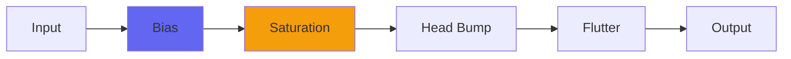

# FromTape

## Quick Info

| | |
|---|---|
| **Category** | Tape |
| **Type** | Tape |
| **Status** | Stable |

## Description

a minimalist, cleaner analog tape emulation

## Detailed Overview

Here’s something more… refined.

FromTape was originally conceived as a ‘bump-less’ ToTape. It appeared with the original ToTape, and then with ToTape3, as a stripped-down version without the head bump, intended as very much the same thing but less bass. In some ways that’s still true.

But, as ToTape grew to version 5, it developed many unusual traits. There was always that untameable head bump code, and its desire to throw DC everywhere (ToTape’s head bump literally doesn’t want to settle on 0, it wants to be either a positive or negative offset voltage by preference). There was the flutter. There was the built-in highpass, coded in a curious way to get a resonant quality around the corner frequency without any actual resonance applied. ToTape grew into a rich and strange effect, with many curious qualities and many fervent fans. And it’s out.

And then there was FromTape.

This FromTape draws on what I’d learned from the Purest plugins. It’s like no previous FromTape: elements have been rearranged, deleted, rethought until it became just this: the ‘unusual’ highpass (which accumulates tiny alterations in a buffer and then applies them in a single add for purity reasons) and THEN the Softer control, accentuated, but ONLY the Softer code and not the ‘Airwindows saturation’ that’s a major part of ToTape and allows for the ‘tape drive’ and saturation effects. The highpass is called ‘Weight’ and wired backwards so as you increase it, more bass comes out.

So, this new FromTape does the very transparent treble softening, but has no real ‘distortion level’ because it has no distortion outside of Softer. It has the highpass (over a far broader range, and adjustable) but not the head bump the highpass was designed to handle. Instead of going after the other effects, the highpass goes first, and then the Softer works on the output of that.

It’s capable of clipping to a set level only if Soften is cranked totally, and then it’s not a good sound (still available, though, in case you want it). Anything else will let peaks through largely undiminished. The highpass cuts bass, but in such a way that clean unclipped bass pre-FromTape might well turn into over 0dB output after FromTape: it cuts the bass in such a way that it might end up 3dB louder. Go figure, use the output level control to buffer it. Rather than loudenating stuff by ‘slamming it with tape saturation’ it’s more likely to reshape the tonality of the sound so it sounds quieter for whatever peak level you’re reaching.

It sounds amazing. It’s also way more CPU-efficient than ToTape, and eats much less in terms of delay buffers and things. You could use it everywhere, certainly on channels where ToTape would be too heavy, but even on channels plus the 2-buss. You could use it in mastering if you wanted to soften digital edge while retaining total clarity, or if you wanted to take an overlimited mix and make the bass rounder and more open, giving a little crest factor back.

I got lucky. FromTape sounds amazing, it really came together in a surprising way. You might like the added thickness and fullness of ToTape, or the bells and whistles, but if you want to call FromTape superior, you won’t be seeing an argument from me. Surprise! This might be your new best tape plugin, especially if you like subtlety and have ears like a bat.

## Signal Flow

## How It Works

FromTape emulates magnetic tape characteristics including specific tape behaviors. Use it to add warmth and analog character.

## Usage Tips

- Start with conservative settings
- A/B compare to hear the effect clearly
- Use in context with other processing
- Trust your ears over visual meters

## Related Plugins

Browse other [Tape](../categories/tape.md) plugins.

## Technical Details

**Source Code**: [View on GitHub](https://github.com/airwindows/airwindows/tree/master/plugins/LinuxVST/src/FromTape)

**Categories**: Tape

**Available Formats**:
- Mac AU
- Mac VST
- Windows VST
- Linux VST

## Resources

- [All Airwindows Plugins](../../README.md)
- [Category: Tape](../categories/tape.md)
- [Airwindows Website](https://www.airwindows.com)
- [Airwindows GitHub](https://github.com/airwindows/airwindows)

---

*Part of the Airwindows plugin collection - Open source audio processing plugins*

*Last updated: 2024*
