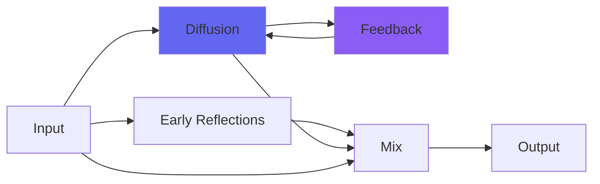

# Galactic

 

## Quick Info

| | |
|---|---|
| **Category** | Reverb |
| **Type** | Reverb |
| **Status** | Stable |

## Description

a super-reverb designed specially for pads and space ambient

## Detailed Overview

Been working on this for a while on Monday coding-streams! Galactic is an extension of my Verbity reverb, designed for ultimate deep space ambient music. It’s a combination feedback and feedforward reverb designed to make wide stereo verb-spaces out of anything, even mono test tones if you like.

It takes in audio (dry/wet control available) and uses the Replace control to determine how much of the new sound coming in should replace the space that’s currently there. Detune shifts the pitch for both channels (in a quadrature pitch shift arrangement that means maximum widening for each sound) and Brightness controls both the brightness going into, and coming out of, the reverb. Replace, Brightness and Detune are designed to be playable on the fly to make your ambient spaces or evolve them. Bigness is the reverb buffers, so you can still alter that but it will make crashing noises when you do (that will then become more infinite spaces).

I think this one is really fun! As you can see it fits with my experimental-music aesthetic (didn’t even have to add Srsly2 on the end of it to make it superwide… though of course I could, and so can you). If you’re not quite that abstract, you can still use it on pads for more normal things. Just set Replace to a lot higher, set the Brightness and Bigness appropriately, and use Detune to chorus out your new huge enormous synth pad, or whatever else needs to have an unreasonably huge and wide stereo field. I’m pretty sure this can become your go-to for epic fields of reverb, no matter what’s meant to be causing them.

## Signal Flow

## How It Works

Galactic creates spatial effects through algorithmic reverb. Use it to add depth, space, and dimension to your tracks.

## Usage Tips

- Less is often more - start conservative
- Use pre-delay for clarity
- EQ the reverb return (cut lows, sometimes highs)
- Match decay time to song tempo

## Related Plugins

Browse other [Reverb](../categories/reverb.md) plugins.

## Technical Details

**Source Code**: [View on GitHub](https://github.com/airwindows/airwindows/tree/master/plugins/LinuxVST/src/Galactic)

**Categories**: Reverb

**Available Formats**:
- Mac AU
- Mac VST
- Windows VST
- Linux VST

## Resources

- [All Airwindows Plugins](../../README.md)
- [Category: Reverb](../categories/reverb.md)
- [Airwindows Website](https://www.airwindows.com)
- [Airwindows GitHub](https://github.com/airwindows/airwindows)

---

*Part of the Airwindows plugin collection - Open source audio processing plugins*

*Last updated: 2024*
