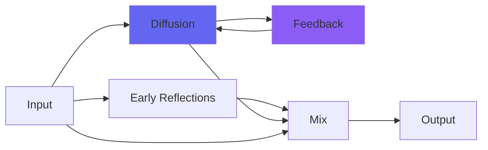

# Galactic3

## Quick Info

| | |
|---|---|
| **Category** | Reverb |
| **Type** | Reverb |
| **Status** | Latest Release |

## Description

exactly Galactic again, but with better undersampling

## Detailed Overview

This is always a bit tricky: I try to revisit my biggest hits and make them better. The last time I did that with Galactic, not only was it merely different, it had a bug that Galactic doesn't have: four variables that didn't get initialized properly. Galactic2 is now fixed and presumably bugless, and is still just 'different', a variation on what Galactic does.

Galactic3 is straight up better. Because it's exactly Galactic again… but instead of the linear interpolation it used to use (like CrunchCoat) for high sample rates, it's now using my new Bezier curve technique to interpolate, like kCathedral3 and CreamCoat.

First, that means it should have better tone at high sample rates. Second, in theory it should gracefully handle even really outrageous sample rates (Galactic will eventually start scaling the verb space down in size, Galactic3 won't). But most importantly, that means you have a Derez control like CreamCoat, except on the reverb engine of Galactic. So you have exactly the sounds of Galactic, but you can further undersample them for a cool 'reduce sample rate' effect… and in doing so, increase the reverb space in size. How much? To unreasonable size: galaxy-sized.

To use the new tone with the same apparent room size, decrease Bigness until the giant space is back to what you want again.

Galactic3 takes in audio (dry/wet control available) and uses the Replace control to determine how much of the new sound coming in should replace the space that’s currently there. Detune shifts the pitch for both channels (in a quadrature pitch shift arrangement that means maximum widening for each sound) and Brightness controls both the brightness going into, and coming out of, the reverb. Replace, Brightness and Detune are designed to be playable on the fly to make your ambient spaces or evolve them. Bigness is the reverb buffers, so you can still alter that but it will make crashing noises when you do (that will then become more infinite spaces). And Derez, the new addition, will snap the whole pitch of the reverb space up and down without otherwise glitching it, so in theory it's playable as well.

I think this one is really fun! As you can see it fits with my experimental-music aesthetic (didn’t even have to add Srsly2 on the end of it to make it superwide… though of course I could, and so can you). If you’re not quite that abstract, you can still use it on pads for more normal things. Just set Replace to a lot higher, set the Brightness and Bigness appropriately, and use Detune to chorus out your new huge enormous synth pad, or whatever else needs to have an unreasonably huge and wide stereo field. I’m pretty sure this can become your go-to for epic fields of reverb, no matter what’s meant to be causing them. And Derez adds darkening abilities beyond the scope of original Galactic. Honestly, I think I finally managed to make it better rather than just different. Let me know what you think :)

## Signal Flow

## How It Works

Galactic3 creates spatial effects through algorithmic reverb. Use it to add depth, space, and dimension to your tracks.

## Usage Tips

- Less is often more - start conservative
- Use pre-delay for clarity
- EQ the reverb return (cut lows, sometimes highs)
- Match decay time to song tempo

## Related Plugins

Browse other [Reverb](../categories/reverb.md) plugins.

## Technical Details

**Source Code**: [View on GitHub](https://github.com/airwindows/airwindows/tree/master/plugins/LinuxVST/src/Galactic3)

**Categories**: Reverb

**Available Formats**:
- Mac AU
- Mac VST
- Windows VST
- Linux VST

## Resources

- [All Airwindows Plugins](../../README.md)
- [Category: Reverb](../categories/reverb.md)
- [Airwindows Website](https://www.airwindows.com)
- [Airwindows GitHub](https://github.com/airwindows/airwindows)

---

*Part of the Airwindows plugin collection - Open source audio processing plugins*

*Last updated: 2024*
