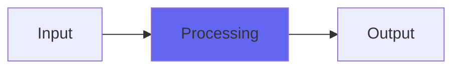

# GalacticVibe

## Quick Info

| | |
|---|---|
| **Category** | Effects |
| **Type** | Effects |
| **Status** | Latest Release |

## Description

the stereo vibrato from the original Galactic reverb

## Detailed Overview

GalacticVibe is about taking the code I used to make the Galactic reverb super wide, and breaking it out into a chorus-like effect… at which it turns out to be great!

Used in Galactic, it's always full wet. It's a dual vibrato that's 'quadrature', meaning the channels are two different offsets on the same LFO. Except it's not exactly an LFO in the sense of low frequency oscillator, because it's slightly irregular. You don't hear it as being super off, but it's a somewhat organic quality whatever speed you choose.

This produces two stereo outputs (even if you're just giving it mono) and the way they modulate is a bit like a miked-up Leslie: the pitch wavers across both channels. But then, if you add dry (which isn't part of Galactic's modulation) that blends against both stereo channels… and you end up with a nice little vibey chorus, with definite Leslie-like qualities, but without any of the speaker emulation and without an accurate pitch modulation on what would be the treble horns (instead, it's something else, a little smoother).

So it turns out the modulation inside Galactic (Galactic2 is different) is quite nice just by itself! In particular, it seems very nice giving slow swirly effects, and ramping up to a quicker speed has a really striking 'leslie, but not leslie' quality. A happy accident that is now yours, because this is an open source, free plugin, so enjoy adding this tool to your stereo toolkit.

All this is paid for by my Patreon, and the better that does the more I can do with it: as promised, the Bricasti reverb is here. Like I said I am not going to make a clone, but I am certain I can both get some useful k-series reverbs inspired by classic Bricasti patches, and design future reverb algorithms that incorporate more Bricast-isms, just from being able to hear it properly and make use of it in the studio. There's also the new Console versions coming along, currently in study mode as I explore a world of classic vinyl records heard in the fullest fidelity, and develop channel EQs that will go along with the new Console versions.

Thanks, and hope you like GalacticVibe!

## Signal Flow

## How It Works

GalacticVibe processes audio in the Effects category. See the description above for specific functionality.

## Usage Tips

- Start with conservative settings
- A/B compare to hear the effect clearly
- Use in context with other processing
- Trust your ears over visual meters

## Related Plugins

Browse other [Effects](../categories/effects.md) plugins.

## Technical Details

**Source Code**: [View on GitHub](https://github.com/airwindows/airwindows/tree/master/plugins/LinuxVST/src/GalacticVibe)

**Categories**: Effects

**Available Formats**:
- Mac AU
- Mac VST
- Windows VST
- Linux VST

## Resources

- [All Airwindows Plugins](../../README.md)
- [Category: Effects](../categories/effects.md)
- [Airwindows Website](https://www.airwindows.com)
- [Airwindows GitHub](https://github.com/airwindows/airwindows)

---

*Part of the Airwindows plugin collection - Open source audio processing plugins*

*Last updated: 2024*
