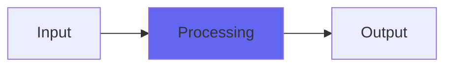

# GrindAmp

## Quick Info

| | |
|---|---|
| **Category** | Amp Sims |
| **Type** | Amp Sims |
| **Status** | Latest Release |

## Description

a heavier amp sim for many purposes

## Detailed Overview

GrindAmp gives sort of a Mesa-y tone, and is good for chugging guitars with some beef to them.

GrindAmp is a followup to FireAmp, and you’ll hear them back-to-back in the video. And where FireAmp is all about that midrange howl and rawness, GrindAmp is a different style: heavier! Thing is, you must understand how these work. They’re distortions voiced to work with guitars, into filtering and truncated, undersampled cab emulation that has dynamic processing. When I say truncated I mean it: there’s very little cabinet rumble or any over-hang beyond the immediate sound. Also, the dry/wet control both brings in dry AMP sound against the cab sim, and also dry guitar sound against the amp sim… at the same time.

So GrindAmp is every bit as much designed for a Rockman-type, extremely direct and dry tone, as it is for an amped, miked tone. It’s sort of a hybrid. Why would you ever do this? For the same reason Def Leppard used Rockmans on Hysteria: you can use this kind of tone to bring in a part without getting in the way of everything else. You can arrange with whole instruments, bringing in stuff to emphasize certain qualities. If you used FireAmp you’d be bringing in extremely raucous midrange, if you use GrindAmp you have a lot more low-end punch and the ability to push the gain a bit higher (though I think it’s at its best when you’re allowing it to be kinda percussive)

Neither of these have chorusing and delay/reverb… but hey! I’ve been putting out plugins that do that, and I bet Chamber will do the slapback thing on a guitar very well, and there’s always PocketVerbs Spring: Airwindows plugins are deeply modular and you already have literally hundreds of them so if you wanted to go full Rockman with GrindAmp (or FireAmp: more to come) then nothing’s stopping you. And they’re free, so nothing is stopping you. And they’re open source, so if you really really REALLY wanted to build them into one plugin… amazingly, you can! Or you can let me make ’em for you :)

## Signal Flow

## How It Works

GrindAmp processes audio in the Amp Sims category. See the description above for specific functionality.

## Usage Tips

- Start with conservative settings
- A/B compare to hear the effect clearly
- Use in context with other processing
- Trust your ears over visual meters

## Related Plugins

Browse other [Amp Sims](../categories/amp-sims.md) plugins.

## Technical Details

**Source Code**: [View on GitHub](https://github.com/airwindows/airwindows/tree/master/plugins/LinuxVST/src/GrindAmp)

**Categories**: Amp Sims

**Available Formats**:
- Mac AU
- Mac VST
- Windows VST
- Linux VST

## Resources

- [All Airwindows Plugins](../../README.md)
- [Category: Amp Sims](../categories/amp-sims.md)
- [Airwindows Website](https://www.airwindows.com)
- [Airwindows GitHub](https://github.com/airwindows/airwindows)

---

*Part of the Airwindows plugin collection - Open source audio processing plugins*

*Last updated: 2024*
