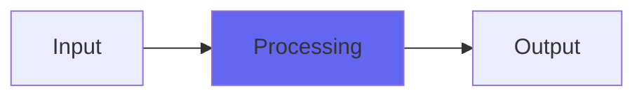

# Gringer

## Quick Info

| | |
|---|---|
| **Category** | Effects |
| **Type** | Effects |
| **Status** | Latest Release |

## Description

a full-wave rectifier plugin, like a Green Ringer guitar effect

## Detailed Overview

Here’s another no-controls wonder… that ‘models’ an actual obscure guitar effect that also has no controls! And it makes horrible unmusical noises, just like the original obscure effect makes horrible unmusical noises! Whee!

Seriously, though, here’s Gringer. It’s like an emulation of the old Dan Armstrong Green Ringer, kinda. No attempt was made to exactly circuit model anything, but it does the full-wave rectification thing that characterizes this effect, you can bypass it by bypassing the plugin, and it’s got a couple of biquad bandpasses (with VERY wide bandwidth) to mimic having analog circuitry and DC-blocking capacitors on input and output.

Stick it on your guitar solo and see what you get. Please don’t stick it on your mastering console. No good will come of that.

## Signal Flow

## How It Works

Gringer processes audio in the Effects category. See the description above for specific functionality.

## Usage Tips

- Start with conservative settings
- A/B compare to hear the effect clearly
- Use in context with other processing
- Trust your ears over visual meters

## Related Plugins

Browse other [Effects](../categories/effects.md) plugins.

## Technical Details

**Source Code**: [View on GitHub](https://github.com/airwindows/airwindows/tree/master/plugins/LinuxVST/src/Gringer)

**Categories**: Effects

**Available Formats**:
- Mac AU
- Mac VST
- Windows VST
- Linux VST

## Resources

- [All Airwindows Plugins](../../README.md)
- [Category: Effects](../categories/effects.md)
- [Airwindows Website](https://www.airwindows.com)
- [Airwindows GitHub](https://github.com/airwindows/airwindows)

---

*Part of the Airwindows plugin collection - Open source audio processing plugins*

*Last updated: 2024*
