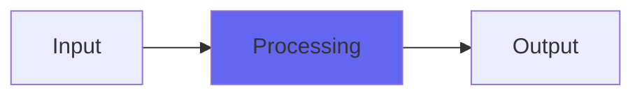

# GrooveWear

  

## Quick Info

| | |
|---|---|
| **Category** | Lo-Fi |
| **Type** | Lo-Fi |
| **Status** | Latest Release |

## Description

for scrubbing highs off mechanically like a stylus would

## Detailed Overview

Here’s something interesting! I revisited some pieces of ToVinyl4, one of ’em being GrooveWear. In fiddling with it, I discovered that I could put in a dedicated wet/dry for just that one part, and if I did, I got perfect high-frequency rolloff at 50%. In other words, as an effect it was working as intended (bit of overshoot available, like the needle was loose in the groove), but I could also redesign it as a tone-softener.

It’s all based on variations of averaging. I’ve got Average to soften just only sample values (it has some interesting quirks but I swear by that algorithm for naturally rolling off highs in a way that doesn’t sound digital). GrooveWear goes one step beyond that, and averages slews (not sample values). That means it’s averaging the rate of change. Then, later, I did Aura, which is averaging the rate of change OF the rate of change… but that’s another story ;)

More importantly, I came up with a nice feature doing the revision. The GrooveWear contained in ToVinyl uses two stages of processing, since it can be a subtle effect. I worked out a convenient way to make the dry/wet control handle multiple stages so, as you increase it, you’re progressively adding stage after stage with the final stage going from dry to wet: it means you can start off with a very mathematically clean amount of effect, just one stage dry/wet, and then keep adding more. And in the spirit of that, I doubled the stages so now GrooveWear has four.

So, you can adjust the intensity control that specifies how much slew averaging the stages are doing (acts like a sort of frequency range control for the effect) or you can adjust the dry/wet to go from pristine to incredibly deep groove wear. It’s partly roll-off of the highs but it’s not JUST normal EQ, texturally it’s quite different because the effect doesn’t try to stop big transients like a square-wave’s sides, it tries to stop smaller-scale detail stuff while retaining the big harmonic content of waves. It’s averaging slew, not deleting it, so certain waveforms get through untouched… you’ll see.

(Followup: this technique of stepping through wet/dry stages was also used for the Z series filters)

## Signal Flow

## How It Works

GrooveWear processes audio in the Lo-Fi category. See the description above for specific functionality.

## Usage Tips

- Start with conservative settings
- A/B compare to hear the effect clearly
- Use in context with other processing
- Trust your ears over visual meters

## Related Plugins

Browse other [Lo-Fi](../categories/lo-fi.md) plugins.

## Technical Details

**Source Code**: [View on GitHub](https://github.com/airwindows/airwindows/tree/master/plugins/LinuxVST/src/GrooveWear)

**Categories**: Lo-Fi

**Available Formats**:
- Mac AU
- Mac VST
- Windows VST
- Linux VST

## Resources

- [All Airwindows Plugins](../../README.md)
- [Category: Lo-Fi](../categories/lo-fi.md)
- [Airwindows Website](https://www.airwindows.com)
- [Airwindows GitHub](https://github.com/airwindows/airwindows)

---

*Part of the Airwindows plugin collection - Open source audio processing plugins*

*Last updated: 2024*
