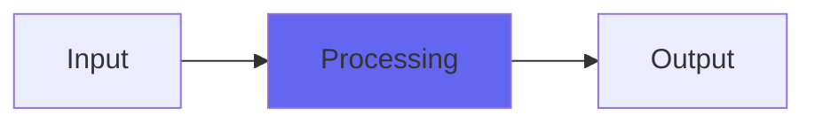

# GuitarConditioner

## Quick Info

| | |
|---|---|
| **Category** | Effects |
| **Type** | Effects |
| **Status** | Latest Release |

## Description

like a Tube Screamer voicing without the squishiness and indistinctness

## Detailed Overview

I designed this plugin when I saw what Slew was capable of. It uses a combination of Slew and Highpass in a sort of parallel matrix arrangement, with heavy use of my Highpass’s unusual tone shaping features (extreme lows get Tight tone shaping behavior, and a boosted mids circuit is set to Loose rolloff for the proper texture). Both aspects hit their own Slew at different levels and with different voicings, causing a distinct tone quality.

This is not a Tube Screamer plugin at all. It’s an alternate tone for doing similar things but with more sonority, focus and impact. It’s intended for Djent style sounds and people who can play much, much better and more aggressively than me :)

The reason Slew is relevant to a Tube Screamer effect is, the guitar pedal uses op-amps that can be limited in their ability to deliver slew and bass. Therefore, they don't only distort and make louder, they also restrict treble and bass in a nonlinear way, and that's the same thing my Slew effect does. So Guitar Conditioner is Airwindows techniques addressing the same purpose.

## Signal Flow

## How It Works

GuitarConditioner processes audio in the Effects category. See the description above for specific functionality.

## Usage Tips

- Start with conservative settings
- A/B compare to hear the effect clearly
- Use in context with other processing
- Trust your ears over visual meters

## Related Plugins

Browse other [Effects](../categories/effects.md) plugins.

## Technical Details

**Source Code**: [View on GitHub](https://github.com/airwindows/airwindows/tree/master/plugins/LinuxVST/src/GuitarConditioner)

**Categories**: Effects

**Available Formats**:
- Mac AU
- Mac VST
- Windows VST
- Linux VST

## Resources

- [All Airwindows Plugins](../../README.md)
- [Category: Effects](../categories/effects.md)
- [Airwindows Website](https://www.airwindows.com)
- [Airwindows GitHub](https://github.com/airwindows/airwindows)

---

*Part of the Airwindows plugin collection - Open source audio processing plugins*

*Last updated: 2024*
