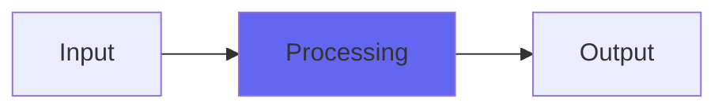

# HardVacuum

## Quick Info

| | |
|---|---|
| **Category** | Utility |
| **Type** | Utility |
| **Status** | Latest Release |

## Description

tube style saturation effects

## Detailed Overview

Time to revisit an Airwindows classic!

This is one of the plugins Airwindows ‘made its bones’ on, brought up to date and converted to VST for Mac, Windows and Linux (and made open source!)

Hard Vacuum refers to vacuum tubes, and as you’d expect it’s a saturation device but with some interesting twists. It’s got a warmth control that brings in second harmonic and nonlinearity like you might see in a class A tube design, but set up to be abused if you’d like to produce exaggerated effects (that aren’t really ‘warm’ anymore, but if you want to play nice, don’t push this control too far). It’s got a nice Airwindows sine-based saturation curve… and it’s got a control called Aura that will bring out sparkly highs and hot searing overtones you might not have heard from a plugin before.

The way that one works is thus: I saw scope traces of tube circuits that were showing slanty tops on squarewaves, like the power supplies weren’t keeping up. It became an obsession to make plugin saturation do that, and I came up with something that turned into Aura. Note that this is NOT ‘analog modeling’, not as people normally mean it: I’m rarely interested in running hapless audio through lots of math pretending to be electronic parts. I generally want a simple, unexpected algorithm that’ll do what I intend with minimal unnecessary math, because I find that overprocessing digital audio hurts the tone.

As such, Aura doesn’t model any specific tube. You could probably combine it with Desk4 and who knows what else, to make a really good emulation given decent reference material, but Aura is simply a way to doctor the tone in a way that’s not EQ. By that I mean, the effect might lift up highs but it’s not working in terms of frequency zones, it sees only the amplitude of any given moment and the angle by which it reached that moment. Think of it as an extra thing you can do to the sound. This one’s sat around being Mac AU only for ten years before getting brought up to date (with denormalization fixes, noise shaping to the floating point buss, etc) and ported to VST, so now most of you can join in the fun.

## Signal Flow

## How It Works

HardVacuum processes audio in the Utility category. See the description above for specific functionality.

## Usage Tips

- Start with conservative settings
- A/B compare to hear the effect clearly
- Use in context with other processing
- Trust your ears over visual meters

## Related Plugins

Browse other [Utility](../categories/utility.md) plugins.

## Technical Details

**Source Code**: [View on GitHub](https://github.com/airwindows/airwindows/tree/master/plugins/LinuxVST/src/HardVacuum)

**Categories**: Utility

**Available Formats**:
- Mac AU
- Mac VST
- Windows VST
- Linux VST

## Resources

- [All Airwindows Plugins](../../README.md)
- [Category: Utility](../categories/utility.md)
- [Airwindows Website](https://www.airwindows.com)
- [Airwindows GitHub](https://github.com/airwindows/airwindows)

---

*Part of the Airwindows plugin collection - Open source audio processing plugins*

*Last updated: 2024*
