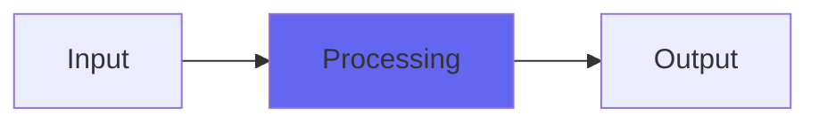

# HighGlossDither

## Quick Info

| | |
|---|---|
| **Category** | Dithers |
| **Type** | Dithers |
| **Status** | Stable |

## Description

a hybrid between shiny dither and truncation! Unnatural science experiment

## Detailed Overview

Here’s an Airwindows science experiment!

The idea here was to identify things about truncation that some people (maybe crazy people, but people nonetheless) like, and build them into a dedicated dither. This video includes extensive exploration of truncation, TPDF and flat dithers besides HighGlossDither, so there’s an educational value as well. As for audio value, the important thing to remember is that this one is designed to act like truncation in important ways… so it’s ‘broken’ and you shouldn’t use it for naturalistic things, and you probably shouldn’t use it unless you’ve ever chosen truncation instead of dither, on purpose, because you wanted the edgier, crunchier, different-textured sound of truncation for what you were doing.

If that’s ever you, this is an alternate way to get your sounds.

The deal with truncation is that it turns the fine details of your mix into a roaring, grunging mess of unnatural noise. The secret of it is, that stuff can act like some horrible sort of parallel compression. It’ll hang onto the tails of notes way longer than it should, and it’ll add intense bit-crusher-like effects to quiet sounds.

HighGlossDither uses a special, more uniform-sounding quadratic residue sequence instead of real randomness to sorta ‘diffract’ sounds into crunchier versions of themselves, and applies it at a quieter level than true dither. The result is a hybrid between dither and truncation: rather than dropping quietly into a sea of noise, quiet sounds get hyped and distorted, but they still behave a lot more normally than truncated sounds do. You get the crazy tonal hype, but a better approximation of the proper relative volume levels of the sounds. And you get a sort of noise but it’s quieter than TPDF is, and also serves a purpose of interacting with the sounds.

Most people shouldn’t like this. I’m introducing it first to get it out of the way… but who knows? Maybe you’re looking to bring out the next generation of Finnish forest psy trance, and the last thing you want is for the molecular structure of your music to sound natural. Well, HighGlossDither might be right up your alley! You don’t have to resort to truncation to have the finest details of your audio sounding weird and unreal. Take it up another level, with my blessing.

Or maybe you’d prefer your audio sounding, you know, good. If so, stay tuned :)

## Signal Flow

## How It Works

HighGlossDither processes audio in the Dithers category. See the description above for specific functionality.

## Usage Tips

- Start with conservative settings
- A/B compare to hear the effect clearly
- Use in context with other processing
- Trust your ears over visual meters

## Related Plugins

Browse other [Dithers](../categories/dithers.md) plugins.

## Technical Details

**Source Code**: [View on GitHub](https://github.com/airwindows/airwindows/tree/master/plugins/LinuxVST/src/HighGlossDither)

**Categories**: Dithers

**Available Formats**:
- Mac AU
- Mac VST
- Windows VST
- Linux VST

## Resources

- [All Airwindows Plugins](../../README.md)
- [Category: Dithers](../categories/dithers.md)
- [Airwindows Website](https://www.airwindows.com)
- [Airwindows GitHub](https://github.com/airwindows/airwindows)

---

*Part of the Airwindows plugin collection - Open source audio processing plugins*

*Last updated: 2024*
