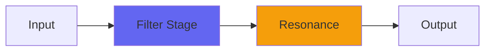

# Holt

## Quick Info

| | |
|---|---|
| **Category** | Filter |
| **Type** | Filter |
| **Status** | Stable |

## Description

a synth-like resonant lowpass filter focussed on bass frequencies

## Detailed Overview

Holt is a plugin suggested by one of my Q&A livestream regulars, that treads the waters of professional accountancy. The plugin, that is, not the regular. As far as I know.

How is this? Simple: Holt is a method you can use in Excel for predicting sales figures based on trends. It basically uses two variables each of which chase each other to try and cut through the noise of realworld data and produce useful predictive results. My friend from the livestream thought it might make a lowpass that was more fuzzy in tonality. It did not do that thing.

Instead, I got something like a low-frequency version of Aura: a resonant lowpass like a synth filter with huge control over the extreme lows. I had to do weird things to get it to track fairly consistently over different resonance settings, because the Holt method doesn’t really have anything like that at all: turning it into a synth filter is strictly my deal. So is the multipole arrangement: this thing morphs seamlessly from no poles (dry) to four poles (24 dB per octave) with intense resonance or no resonance at all, based on how you set it.

It’s got an instance of Spiral built in to save you when you make it squawk, because otherwise it’ll blow up your bassbins and just laugh at you. This sucker is MEAN from the midrange on down. The interesting thing is, if you crank the frequency up it tames itself and reverts immediately to dry again. It ONLY does its madness on the lows, and high frequencies are completely tame and nice. You can use it as a sophisticated and well-behaved lowpass on the upper mids and highs, and it’s totally polite. It’s just when you drop the cutoff frequency down that it explodes in juicy bass.

There are even several ways to go between that and clean, untouched audio. You can raise the cutoff, or you can use the dry/wet control, OR you can use the poles control (at any resonance setting) to morph it from bassy madness to perfect clarity… because the poles control is four different dry/wet controls bundled into one. This also means that if you’re using less than one pole of filter, you’re not even running through the other stages: less processing, unless you want it.

It can act like a DJ ‘isolator’, it can act like a synth bass lowpass, it can damn near self-resonate, and all from just a couple variables (per pole) that interact strangely. It’s a neat example of extreme simplicity (like the Purest series) producing a striking result. Have fun and I hope you like it.

## Signal Flow

## How It Works

Holt shapes frequencies through filtering. Use it for tone shaping, problem solving, or creative sound design.

## Usage Tips

- Make small adjustments - EQ is powerful
- Cut first, boost second (if needed)
- Check your changes in context with the full mix
- Use solo to identify problem frequencies

## Related Plugins

Browse other [Filter](../categories/filter.md) plugins.

## Technical Details

**Source Code**: [View on GitHub](https://github.com/airwindows/airwindows/tree/master/plugins/LinuxVST/src/Holt)

**Categories**: Filter

**Available Formats**:
- Mac AU
- Mac VST
- Windows VST
- Linux VST

## Resources

- [All Airwindows Plugins](../../README.md)
- [Category: Filter](../categories/filter.md)
- [Airwindows Website](https://www.airwindows.com)
- [Airwindows GitHub](https://github.com/airwindows/airwindows)

---

*Part of the Airwindows plugin collection - Open source audio processing plugins*

*Last updated: 2024*
