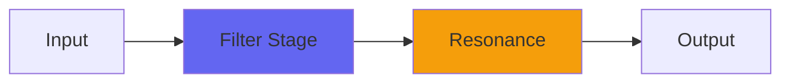

# Holt2

## Quick Info

| | |
|---|---|
| **Category** | Filter |
| **Type** | Filter |
| **Status** | Latest Release |

## Description

a bass-cab-like resonant lowpass filter

## Detailed Overview

Holt2 extends what I did with Holt, to produce an astonishing effect like Aura for bass.

How is this? Simple: Holt is a method you can use in Excel for predicting sales figures based on trends. It basically uses two variables each of which chase each other to try and cut through the noise of realworld data and produce useful predictive results. My friend from the livestream thought it might make a lowpass that was more fuzzy in tonality. It did not do that thing.

Instead, I got something like a low-frequency version of Aura: a resonant lowpass like a synth filter with huge control over the extreme lows. I had to do weird things to get it to track fairly consistently over different resonance settings, because the Holt method doesn’t really have anything like that at all: turning it into a synth filter is strictly my deal. So is the multipole arrangement: this thing morphs seamlessly from no poles (dry) to eight poles (48 dB per octave) with intense resonance or no resonance at all, based on how you set it.

The changes from the original Holt are, it's got more poles of filtering, and no longer has the Spiral soft-clip built in. So, if you're incautious with this it might blow stuff up real good. It won't quite self-resonate but it sure throws out a lot of resonance, which is sometimes just the ticket for making amplike tones out of beefy sounds.

I'm going to be using this as a go-to bass sound, which makes use of DI bass immediately less studio-y. It'll also handle automation nicely (except the Poles control doesn't like to be automated) opening up modern electronic music effects on what might seem like a set-and-forget bass amp. But since there's the dry/wet control, you might also find Holt2 just the ticket for taking guitar sounds (either real or plugin) and throwing thunderous cab weight behind them. Dial in the desired huge rumbling low-end, and then go all dry, crank the output level and sneak in just enough of the super-lows to expand your guitar tone. It might also find other uses: let me know if anything really clicks for you!

## Signal Flow

## How It Works

Holt2 shapes frequencies through filtering. Use it for tone shaping, problem solving, or creative sound design.

## Usage Tips

- Make small adjustments - EQ is powerful
- Cut first, boost second (if needed)
- Check your changes in context with the full mix
- Use solo to identify problem frequencies

## Related Plugins

Browse other [Filter](../categories/filter.md) plugins.

## Technical Details

**Source Code**: [View on GitHub](https://github.com/airwindows/airwindows/tree/master/plugins/LinuxVST/src/Holt2)

**Categories**: Filter

**Available Formats**:
- Mac AU
- Mac VST
- Windows VST
- Linux VST

## Resources

- [All Airwindows Plugins](../../README.md)
- [Category: Filter](../categories/filter.md)
- [Airwindows Website](https://www.airwindows.com)
- [Airwindows GitHub](https://github.com/airwindows/airwindows)

---

*Part of the Airwindows plugin collection - Open source audio processing plugins*

*Last updated: 2024*
