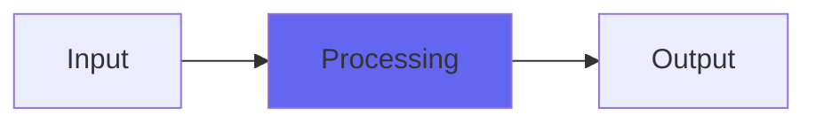

# Hombre

## Quick Info

| | |
|---|---|
| **Category** | Ambience |
| **Type** | Ambience |
| **Status** | Latest Release |

## Description

atmosphere and texture (through very short delays)

## Detailed Overview

Once upon a time there was the blues.

No, let’s be more specific. Once upon a time (and even now!) there was ZZ Top. Brainchild of the Reverend Billy Gibbons, swathed in funk and mystery, serving up juicy grooves from the heart of Texas.

Thing is, Rev. Billy tells some tall tales and their engineer of the day, Terry Manning, he don’t talk ATALL.

So what is a person to do when they hear these albums and the guitars slide off that vinyl like grease off a hot griddle, and you know you can’t just put up a mic on anything amp-shaped and get near that magic? You know those are dirt guitars, but the whole texture’s different. Skulduggery is afoot. And the boys ain’t tellin’.

Well, here’s what I did. It seemed to me that some of the mojo sounded like echoes and delays, but not just any old ones. You can take something as small as a dentist’s mirror, put it near the mic, and aim it until you’re reflecting another copy of your sound into the mic again: the delay is tiny but real, and the tone? Well, that’s based on how big the panel (or dentist’s mirror) is. If it’s tiny, you get only highs. If it’s a big ol’ panel, or a floor or wall, you get down into maybe the lowest bass. Any panel will do this. Billy and Terry might have been constructing lil’ forts around the amps, making a purely acoustic home for the blues. You can literally pick what range of sound you reflect, how long a delay it is (still so tiny it’s not heard as one!) and you don’t have to make it full-range: a softer reflector ignores highs, smaller panels ignore lows. If you want to juice up what your mic hears, this is one way to do it.

If you’re playing with super-short echoes, you’re reinforcing the lows. Unless it’s out of phase, flipped upside down in the DAW, in which case you’re cancelling them! And then, supposing you have one delay that’s in phase and one that’s out, and you calibrate them just right, and then you’re neither reinforcing or cancelling the lows, instead you’re just thickening the texture of whatever you’ve got… all the little detail doubled, tripled, dripping down the mix, but the body of the thing basically the same and no sustain, just a couple of delay taps in real close…

I’m not Billy and Terry. Since I’m Chris, I’ll fess up: that’s exactly what I did, and you can have it in Hombre. It’s two calibrated delay taps, which you can tweak a little, and if you bring them in you’ll thicken and diffuse your tones without altering where the lows sit, or adding much in the way of extra sustain. It’ll be punchy and get out of the way like reverb won’t, but it’ll be fatter and juicier than the dry signal. This is my interpretation of the ZZ Top secret sauce, or at least one of ’em, implemented in software rather than acoustics.

I’ll never know how close I came, because them Texas boys don’t tell tales out of school. But Hombre is my humble offering for a simple plugin that brings a little mojo to what would otherwise be a dry voice or guitar… and it won’t muddy things up, just grease ’em a little.

## Signal Flow

## How It Works

Hombre processes audio in the Ambience category. See the description above for specific functionality.

## Usage Tips

- Start with conservative settings
- A/B compare to hear the effect clearly
- Use in context with other processing
- Trust your ears over visual meters

## Related Plugins

Browse other [Ambience](../categories/ambience.md) plugins.

## Technical Details

**Source Code**: [View on GitHub](https://github.com/airwindows/airwindows/tree/master/plugins/LinuxVST/src/Hombre)

**Categories**: Ambience

**Available Formats**:
- Mac AU
- Mac VST
- Windows VST
- Linux VST

## Resources

- [All Airwindows Plugins](../../README.md)
- [Category: Ambience](../categories/ambience.md)
- [Airwindows Website](https://www.airwindows.com)
- [Airwindows GitHub](https://github.com/airwindows/airwindows)

---

*Part of the Airwindows plugin collection - Open source audio processing plugins*

*Last updated: 2024*
