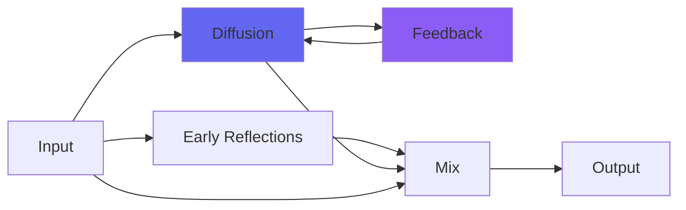

# Infinity

## Quick Info

| | |
|---|---|
| **Category** | Reverb |
| **Type** | Reverb |
| **Status** | Stable |

## Description

a MatrixVerb specifically designed to sustain and layer sounds forever

## Detailed Overview

Here’s a follow-up to what I’ve been doing with Householder reverbs, and my recent plugins MatrixVerb (for flexibility) and Reverb (optimized for size variation only). The algorithm I’m using has one more specialty: infinity! The way it works, if you do nothing else except feed it back on itself, it will sustain infinitely: that’s its basic, natural state.

And so I did. :)

Of course that’s too simple: there’s a filter (not in the feedback path) that will let you sweep its frequencies in and out, from deep space to bright and unnatural textures. There’s a size control that will let you resize the space from gong-like tones to the depths of galaxies… and a damping control that does NOT make the reverberations die away. Instead, it just applies a subtle darkening, useful if you’re looking for darker spaces.

More importantly, Infinity is tailored to handle anything from subtle noises to the full blast of a mix: if you saturate it and keep adding sound, what’ll happen is that it’ll begin to squeeze out earlier infinity to make room for what’s coming in. That way, the maximum level will stay under control, but it’ll also tend to emphasize the most recent thing you did (as long as it’s loud). If you’re not adding loud things, you’ll continue to build up the texture as you go.

It’s also a dual mono effect. What that means is, you’re adding things to infinitely sustain at distinct places in the stereo image. What’s on the left stays on the left, likewise with the right, centered stuff will stay centered. This is different from both MatrixVerb and Reverb, both of which will ‘spread’ centered information as the reverb continues. Infinity doesn’t have the stereo pitch shifting that would cause that to happen, because it’s entirely dedicated to providing pads and spaces that can literally sustain forever without change. So, it can also sustain a sound-space across the stereo field that doesn’t change the stereo mix, either. You can keep things mostly panned to the center, or put in super-wide stuff that’s fully L or R, or both.

My hope is that this is an inspiring tool for those who like making ambient spaces. You can combine it with MatrixVerb to have a distinct, unvarying source of infinite sound which is then broadened and made richer by the added options of MatrixVerb in a way you couldn’t do from MatrixVerb alone. Or, you can just use it as its own little instrument. Hope you like it!

## Signal Flow

## How It Works

Infinity creates spatial effects through algorithmic reverb. Use it to add depth, space, and dimension to your tracks.

## Usage Tips

- Less is often more - start conservative
- Use pre-delay for clarity
- EQ the reverb return (cut lows, sometimes highs)
- Match decay time to song tempo

## Related Plugins

Browse other [Reverb](../categories/reverb.md) plugins.

## Technical Details

**Source Code**: [View on GitHub](https://github.com/airwindows/airwindows/tree/master/plugins/LinuxVST/src/Infinity)

**Categories**: Reverb

**Available Formats**:
- Mac AU
- Mac VST
- Windows VST
- Linux VST

## Resources

- [All Airwindows Plugins](../../README.md)
- [Category: Reverb](../categories/reverb.md)
- [Airwindows Website](https://www.airwindows.com)
- [Airwindows GitHub](https://github.com/airwindows/airwindows)

---

*Part of the Airwindows plugin collection - Open source audio processing plugins*

*Last updated: 2024*
