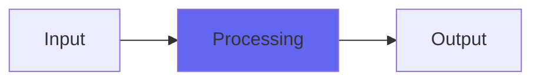

# Interstage

 

## Quick Info

| | |
|---|---|
| **Category** | Subtlety |
| **Type** | Subtlety |
| **Status** | Latest Release |

## Description

a subtle and sophisticated analogifier

## Detailed Overview

Interstage is one half of an experiment. I pitted my ability to use my weird techniques (interleaved IIR, slew limiting, etc) against my new biquad filtering techniques, in the battle of the bandpasses. The biquads could give me total DC rejection and total rejection near Nyquist. My more distinctly Airwindows tricks could give me new sorts of nonlinearity and tone. Which would win?

This isn’t called ‘Biquadstage’, so that might be a bit of a giveaway.

Interstage isn’t a loudenator. It doesn’t really clip (though it does go dark as you push the highs harder, in a way I’ve never done before). It doesn’t even preserve the output peaks of heavily limited material: it’ll reshape lows in such a way that the peaks might go up slightly as the deepest lows get rearranged, and it doesn’t really eliminate DC offset either. So what does it actually do?

*deep breath*

Two level total of three pole IIR highpass which subtracts a pre-averaged sample and slew limits (all right, clips) against not the direct signal but the initial stage IIR lowpassed reference point used as part of the highpass. Oh, also the average it uses isn’t the previous input sample, but the slew limited highpassed output.

*crickets*

No, I am NOT making that up. That’s literally what it does, you can see the code.

What does it sound like? It sounds like running through an optimal analog stage. The lows are reshaped in a characteristic way for a capacitor-coupled circuit that still allows extended lows: this doesn’t suppress much if any extreme bass. It just massages it a bit. The highs run into active component electronic limits, but unlike other approaches (Channel for a bit of grit, Acceleration for ultra-clear) this is restricting treble slews based on the general amount of energy in the circuit. So it goes darker in a peculiarly analog-like way I’ve not done before, sounding still clear and trebly for most audio, but confining the craziest most digital-sounding treble swings into a zone that sounds like hardware. And this is without thousands of math operations of heavy processing: unlike overprocessed analog modeling, this one nails the ‘energy coming out of analog circuitry’ without blurring or thinning the audio at all. If you don’t need what it’s doing you’ll hear no change at all. Only when ‘excessively digital bass and treble’ show up to interfere, does Interstage kick in.

## Signal Flow

## How It Works

Interstage processes audio in the Subtlety category. See the description above for specific functionality.

## Usage Tips

- Start with conservative settings
- A/B compare to hear the effect clearly
- Use in context with other processing
- Trust your ears over visual meters

## Related Plugins

Browse other [Subtlety](../categories/subtlety.md) plugins.

## Technical Details

**Source Code**: [View on GitHub](https://github.com/airwindows/airwindows/tree/master/plugins/LinuxVST/src/Interstage)

**Categories**: Subtlety

**Available Formats**:
- Mac AU
- Mac VST
- Windows VST
- Linux VST

## Resources

- [All Airwindows Plugins](../../README.md)
- [Category: Subtlety](../categories/subtlety.md)
- [Airwindows Website](https://www.airwindows.com)
- [Airwindows GitHub](https://github.com/airwindows/airwindows)

---

*Part of the Airwindows plugin collection - Open source audio processing plugins*

*Last updated: 2024*
