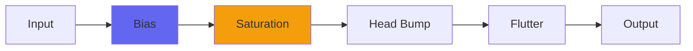

# IronOxideClassic2

## Quick Info

| | |
|---|---|
| **Category** | Tape |
| **Type** | Tape |
| **Status** | Latest Release |

## Description

my bandpassy tape sim, updated for high sample rate and aliasing control

## Detailed Overview

Iron Oxide was one of my first successful plugins. It’s an old school tape emulation, meaning that it’s kind of bandpassy and is about saturating and slamming and aggressive tone coloring. It was made to compete with a pricey (well, back then it was) commercial plugin where the company had treated some of my friends poorly: I charged off and made a ‘commercial tape emulation killer’ plugin, with very unorthodox techniques. This is before my ToTape plugins, before head bumps: just a fat saturated tape-slam plugin.

This grew to have all sorts of things: separate ips controls for low and high cutoffs, flutter, just lots of stuff. But the original one was an input, a tape speed control, and an output… and Iron Oxide Classic is me returning to those roots. It’s also handy, because as I bring in stuff like undersampling of delay buffer plugins, I can get the fundamentals right on a simpler build. That’s what this is. It’s Iron Oxide Classic, the simplest form, but brought up to the latest technical specs.

That means it’s using the undersampling to deliver the same tone whether you’re at 44.1k or 96k or 192k. Though it uses delay buffers and samples along a time window, in the new version that’s consistent among sample rates. That also means it’s substantially more CPU-friendly at high rates, so you might be able to run twice or four times as many of ’em. It’s also using anti-aliasing filtering (that kicks in at high rates and isn’t ‘in circuit’ at low rates) to clean up its behavior still further. The end result is that the new Iron Oxide Classic has a way more organic, natural tone than the previous one did. These things (and running projects at 2X or 4X) really help get the analog vibe out of ITB digital gear. Since Iron Oxide Classic 2 is able to adapt to this stuff gracefully, that also means it’ll handle rendering at 2x or 4X sample rate should your workflow require working at 1X and then rendering out the final audio at a higher rate. Mind you, I design stuff so you’ll be able to work directly at the higher rate, but this should have you covered whatever your workflow.

## Signal Flow

## How It Works

IronOxideClassic2 emulates magnetic tape characteristics including specific tape behaviors. Use it to add warmth and analog character.

## Usage Tips

- Start with conservative settings
- A/B compare to hear the effect clearly
- Use in context with other processing
- Trust your ears over visual meters

## Related Plugins

Browse other [Tape](../categories/tape.md) plugins.

## Technical Details

**Source Code**: [View on GitHub](https://github.com/airwindows/airwindows/tree/master/plugins/LinuxVST/src/IronOxideClassic2)

**Categories**: Tape

**Available Formats**:
- Mac AU
- Mac VST
- Windows VST
- Linux VST

## Resources

- [All Airwindows Plugins](../../README.md)
- [Category: Tape](../categories/tape.md)
- [Airwindows Website](https://www.airwindows.com)
- [Airwindows GitHub](https://github.com/airwindows/airwindows)

---

*Part of the Airwindows plugin collection - Open source audio processing plugins*

*Last updated: 2024*
