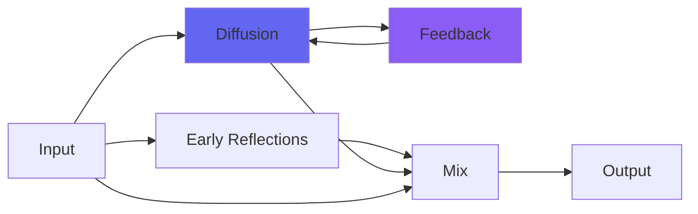

# kAlienSpaceship

 

## Quick Info

| | |
|---|---|
| **Category** | Reverb |
| **Type** | Reverb |
| **Status** | Latest Release |

## Description

an unreal realistic reverb

## Detailed Overview

Though I've got a lot of other irons in the fire, my work on reverbs is ramping up something fierce. I'm going through millions of possibilities with a genetic algorithm, then turning around and rendering out dozens (hundreds!) of possibilities, mostly in the area of small spaces like kStation because they seem to lend themselves to what I'm doing.

And then there's kAlienSpaceship. If I can top this one, I will, but the work's going in the other direction at the moment, so it's time to put out the mothership.

This one works like recent reverbs do: it's got the same controls such as a DeRez and a Filter control that are both Bezier undersampling, and both two-way controls with 'brightest or highest sample rate' at the center, left for stepped and 'good sounding' tones, and right for an edgier, stranger take. Moving DeRez to the right can produce a 'pitch dive' effect while the effect is still running: move it to the left to cleanly shift the entire reverb down in pitch and make it even more massive in size.

The intention here is to make an 'unreal realistic' reverb. Not a giant real-world room or hall, but more like an imaginary space… indeed, a spaceship. It's so vast it doesn't come off like a real room, but neither does it have the abstractness of something like Galactic. Instead it suggests strange geometries, unusual shapes. It was designed back when I was still debugging Bezier Undersampling, and had an odd alien quality, but it's up to speed with my current work so there's a realism factor too. It's synthetic and realistic, pristine but quirky. Not as much as the earlier reverb that acted like there was a slapback integrated into the reverb, but enough to produce a real character.

Use kAlienSpaceship if you're looking for a very big hall or stadium, or if you're doing a synthetic thing and want to gloss it up with deep shimmery ambience, or if you need to expand something out into seemingly infinite space. You can set it to be many kinds of realistic, but it'll also go way beyond that into spaces that bear no relation to reality. I find it to have a fun imaginary quality that sits well with artifical sounds, but you needn't stop there. Hope you like the new spaceship to go play music in! :)

## Signal Flow

## How It Works

kAlienSpaceship creates spatial effects through algorithmic reverb. Use it to add depth, space, and dimension to your tracks.

## Usage Tips

- Less is often more - start conservative
- Use pre-delay for clarity
- EQ the reverb return (cut lows, sometimes highs)
- Match decay time to song tempo

## Related Plugins

Browse other [Reverb](../categories/reverb.md) plugins.

## Technical Details

**Source Code**: [View on GitHub](https://github.com/airwindows/airwindows/tree/master/plugins/LinuxVST/src/kAlienSpaceship)

**Categories**: Reverb

**Available Formats**:
- Mac AU
- Mac VST
- Windows VST
- Linux VST

## Resources

- [All Airwindows Plugins](../../README.md)
- [Category: Reverb](../categories/reverb.md)
- [Airwindows Website](https://www.airwindows.com)
- [Airwindows GitHub](https://github.com/airwindows/airwindows)

---

*Part of the Airwindows plugin collection - Open source audio processing plugins*

*Last updated: 2024*
