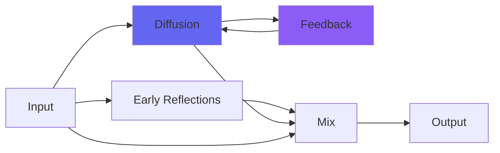

# kBeyond

 

## Quick Info

| | |
|---|---|
| **Category** | Reverb |
| **Type** | Reverb |
| **Status** | Latest Release |

## Description

a recital hall

## Detailed Overview

Turns out there's a technology to beat all AI: the genetic algorithm. GA. And if you know how to steer it, you can do anything.

kBeyond is a first real example of what that can do. It's two different reverb matrices in one plugin, the first generating early reflections and the second expanding them into an eerily believable acoustic space.

I did it by telling the genetic algorithm to try millions upon millions of different matrices, and evaluate them in various ways. Like, constructing all the end-result echoes from the Householder matrix, and then seeing how many of those combinations were primes (people are used to putting primes in the individual delays of the matrix, but it does nothing! It's how many of the end results add up to a prime). Or measuring the gaps between echo returns, and seeing if they're similar or all different (this increases the depth and naturalness of the sound). Or working out what the intersample peaking of the reverb will be, and preferring lower treble energy out of it. Or wanting the first echoes to happen almost immediately, which means there has to be a path through the matrix that is very short.

I put together a small hall out of this, without too much furniture or weird architecture (yes, I can specify that too) and it's yours now. It's using a 3x3 and a 6x6 Householder matrix inside, so before it even gets into regeneration it's producing 1.25 million echo returns (previous kVerbs before VerbSixes? 3125, for not much if any CPU savings). It's using Bezier undersampling to sound right at high sample rates with no penalty in CPU to speak of. It's got just enough controls to adapt to many needs, but is essentially simple to use: keep things near default, tune your RT60 and loudness of early reflections and the filtering on the deep reverb to tune the brightness of the hall. Use Derez if you want to scale it up while darkening it.

There will be more grandiose spaces (heck, you have VerbSixes for that). But in certain ways, there won't be more impressive spaces for a while, because whatever sound you put into kBeyond, it ought to sound like you've just gone on the road and into a hall and put up some mics. It's not even a texture, it's just there, invisibly, making things real.

Compare this to, say, ClearCoat, and you can see why I didn't stop there.

Expect more. All the reverbs kinda need an update now that I can do this…

## Signal Flow

## How It Works

kBeyond creates spatial effects through algorithmic reverb. Use it to add depth, space, and dimension to your tracks.

## Usage Tips

- Less is often more - start conservative
- Use pre-delay for clarity
- EQ the reverb return (cut lows, sometimes highs)
- Match decay time to song tempo

## Related Plugins

Browse other [Reverb](../categories/reverb.md) plugins.

## Technical Details

**Source Code**: [View on GitHub](https://github.com/airwindows/airwindows/tree/master/plugins/LinuxVST/src/kBeyond)

**Categories**: Reverb

**Available Formats**:
- Mac AU
- Mac VST
- Windows VST
- Linux VST

## Resources

- [All Airwindows Plugins](../../README.md)
- [Category: Reverb](../categories/reverb.md)
- [Airwindows Website](https://www.airwindows.com)
- [Airwindows GitHub](https://github.com/airwindows/airwindows)

---

*Part of the Airwindows plugin collection - Open source audio processing plugins*

*Last updated: 2024*
