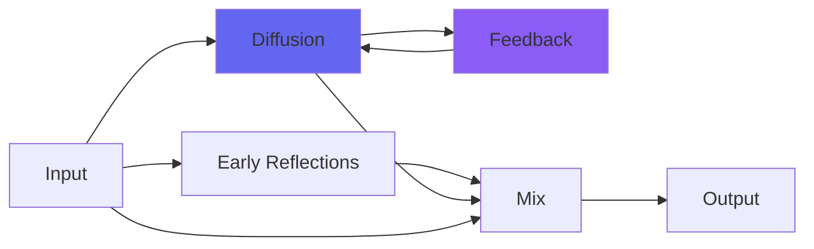

# kCathedral

## Quick Info

| | |
|---|---|
| **Category** | Reverb |
| **Type** | Reverb |
| **Status** | Stable |

## Description

a giant reverby space

## Detailed Overview

Here's a neat little experiment! As always with the K reverbs, it's a dedicated sound space with its own unique algorithm… but there are some new twists making kCathedral a step along an interesting path. This is the first of the Bricasti-inspired reverbs!

It uses a 5x5 Householder matrix, and a built-in crossover (a SubTight filter, so it's not even a normal type of filter) to allow for extra delay on the lows. The internal reverb filtering is Pear filters rather than the biquads used on the kPlates. (the reverb is undersampled at high sample rates, so the SubTight crossover will work the same whether at 1x, 2x, or 4x.)

And for all that trouble… kCathedral does NOT sound the same as the Bricasti Cathedral preset. You won't find a clone here.

But… it will produce largely the same depth and spatiality, with a different texture that is less 'rich and soft' and more 'stark and vibey'. It should be used similarly: for realism, hide it behind other sounds by keeping it quiet. There are no controls other than a dry/wet: for use on an aux, go full wet, and if you're using it inline you might end up adding just the tiniest amount (in the video, I'm using 0.03 of it on my voice, and you'll barely notice it until it switches to similarly faint ClearCoat 7, just for a sentence, after having mentioned ClearCoat.)

My hope for these is distinctness, and kCathedral might not be the one to reach for as an 'all-purpose' reverb, because it's just a first steo into a larger, more echoey new world. The thing I like about it is, while it has a distinct sound, the spatiality sits in the mix roughly the same way a real Bricasti might, even while the texture is different (will be interesting to see if I can get closer to that butter tone, in future).

All in all, a good day at work (okay, months) and I hope you enjoy kCathedral :)

## Signal Flow

## How It Works

kCathedral creates spatial effects through algorithmic reverb. Use it to add depth, space, and dimension to your tracks.

## Usage Tips

- Less is often more - start conservative
- Use pre-delay for clarity
- EQ the reverb return (cut lows, sometimes highs)
- Match decay time to song tempo

## Related Plugins

Browse other [Reverb](../categories/reverb.md) plugins.

## Technical Details

**Source Code**: [View on GitHub](https://github.com/airwindows/airwindows/tree/master/plugins/LinuxVST/src/kCathedral)

**Categories**: Reverb

**Available Formats**:
- Mac AU
- Mac VST
- Windows VST
- Linux VST

## Resources

- [All Airwindows Plugins](../../README.md)
- [Category: Reverb](../categories/reverb.md)
- [Airwindows Website](https://www.airwindows.com)
- [Airwindows GitHub](https://github.com/airwindows/airwindows)

---

*Part of the Airwindows plugin collection - Open source audio processing plugins*

*Last updated: 2024*
