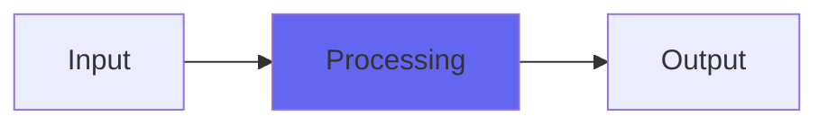

# kChamberAR

## Quick Info

| | |
|---|---|
| **Category** | Ambience |
| **Type** | Ambience |
| **Status** | Latest Release |

## Description

a take on tape echo into chamber echo

## Detailed Overview

While I'm working on other stuff, here's a wild little toy!

I've been struggling to get the sound of the Abbey Road chamber, on my Monday streams. Pretty sure what I'm doing works better with larger spaces (which I'm certainly going to do) and that I've got to dig into other approaches for studio-friendly, nice chambers (which I'm certainly going to do, especially since I might get to my goal June or July and get the Bricasti to study).

So I didn't get the Abbey Road chamber, not really. But what did I get?

Welcome to kChamberAR! Instead of a nice, classy Abbey Road chamber, it's a tape echo into a chamber gone terribly wrong. Or maybe it won't seem so wrong… but it's dirty, aggressive, and wild. If you crank the regeneration up it distorts and goes into infinite echo. If you crank up the bass cut, it filters way harder than the real Abbey Road STEED unit ('cos why not), and if you mess with the delay time, you get wild pitch modulations, all of which feed into the little, boxy, room.

I honestly think this works better as an instrument and didn't work as a capital-C Chamber, much less the Abbey Road chamber. There's better to come, as far as serious chamber emulations go. When I do meet my goal and get the Bricasti to study, chambers will be first in my investigations, and I'll get to the bottom of the problem.

Oh… because the delay works like you're speeding up the tape more and more, if you crank it all the way to the left for minimum delay, it's probably eating more CPU. For predelay keep it in the middle and it should be fine for that. The reason it goes that much faster is, you can tune the delay to bass notes like a monstrous Karplus-Strong oscillator which then drives (overdrives) a small room. And this is such a horrifying, awesome sound that I had to let you have it.

I'll have more legit stuff coming soon. For now, have fun with the new monstrosity. It won't behave, but nothing you have will make noises like it, and that's always part of what I do :)

## Signal Flow

## How It Works

kChamberAR processes audio in the Ambience category. See the description above for specific functionality.

## Usage Tips

- Start with conservative settings
- A/B compare to hear the effect clearly
- Use in context with other processing
- Trust your ears over visual meters

## Related Plugins

Browse other [Ambience](../categories/ambience.md) plugins.

## Technical Details

**Source Code**: [View on GitHub](https://github.com/airwindows/airwindows/tree/master/plugins/LinuxVST/src/kChamberAR)

**Categories**: Ambience

**Available Formats**:
- Mac AU
- Mac VST
- Windows VST
- Linux VST

## Resources

- [All Airwindows Plugins](../../README.md)
- [Category: Ambience](../categories/ambience.md)
- [Airwindows Website](https://www.airwindows.com)
- [Airwindows GitHub](https://github.com/airwindows/airwindows)

---

*Part of the Airwindows plugin collection - Open source audio processing plugins*

*Last updated: 2024*
