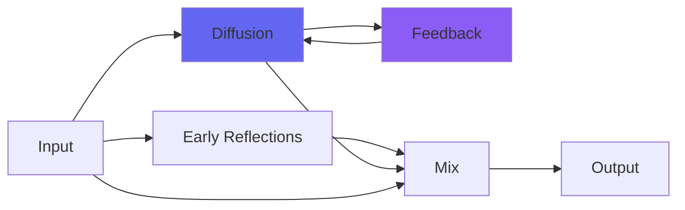

# kPlate140

 

## Quick Info

| | |
|---|---|
| **Category** | Reverb |
| **Type** | Reverb |
| **Status** | Latest Release |

## Description

a next-generation Airwindows plate reverb

## Detailed Overview

Time for the big plate!

kPlate140 is a lot like the smaller version, kPlate240, to the point that you might ask, what's up with that? Can't you simply make the 240 version sustain a little longer, maybe dial in some EQ, and not need to have a whole separate plugin?

Much like kPlate240, kPlate140 is a 5x5 Householder matrix with a plate-style delay density, Pear filters, and the use of SubTight. Where a lot of reverbs out there will be different EQ settings etc. on one basic algorithm (or a small number of them), it's true that it's got the same sliders doing the same things and if you can use one you can use the other… but the way these are designed involves generating thousands or hundreds of thousands of possible Householder matrices and testing them to try and work out what would give the best sound. That means they've got better during the time I've developed the technique… but it also means each new 'best algorithm' is unique. Sometimes there's a lucky break, like the original Galactic one (a 4x4) that was used again for Galactic3, sometimes not so much like the original kCathedral that people felt was metallic.

And then when you're trying to do a literal plate which very much has its own sound qualities… and some years ago I did build a DIY real-world physical plate reverb, so I'm familiar with the sound though I couldn't get it up to EMT140 quality and didn't keep it… well, dialing in the sound involves getting all that stuff tuned up uniquely to the plugin in question.

kPlate140 isn't meant to duplicate kPlate240. My take on the gold foil reverb is that it's cloudier, more understated: from reports of people who use both sorts, it's got a thing of its own but it's the big 375 pound monster (600 pounds packed for shipping) that really gets people's attention. And so, kPlate140 takes a different angle, with all of its parts tuned for that flashier, deeper, more fiery sound that's not part of the more subdued 240.

140 plates come in all sounds and varieties: much like with the earlier attempt at plate reverbs, kPlateA through D, each one will sound different. kPlate140's the one that is yours, much like kPlate240 is. I'm hoping this will come in handy in situations where you're looking for a plate reverb plugin, but are going for that BIG sound. You get to have both! Have fun bathing in reverb :)

## Signal Flow

## How It Works

kPlate140 creates spatial effects through plate emulation. Use it to add depth, space, and dimension to your tracks.

## Usage Tips

- Less is often more - start conservative
- Use pre-delay for clarity
- EQ the reverb return (cut lows, sometimes highs)
- Match decay time to song tempo

## Related Plugins

Browse other [Reverb](../categories/reverb.md) plugins.

## Technical Details

**Source Code**: [View on GitHub](https://github.com/airwindows/airwindows/tree/master/plugins/LinuxVST/src/kPlate140)

**Categories**: Reverb

**Available Formats**:
- Mac AU
- Mac VST
- Windows VST
- Linux VST

## Resources

- [All Airwindows Plugins](../../README.md)
- [Category: Reverb](../categories/reverb.md)
- [Airwindows Website](https://www.airwindows.com)
- [Airwindows GitHub](https://github.com/airwindows/airwindows)

---

*Part of the Airwindows plugin collection - Open source audio processing plugins*

*Last updated: 2024*
