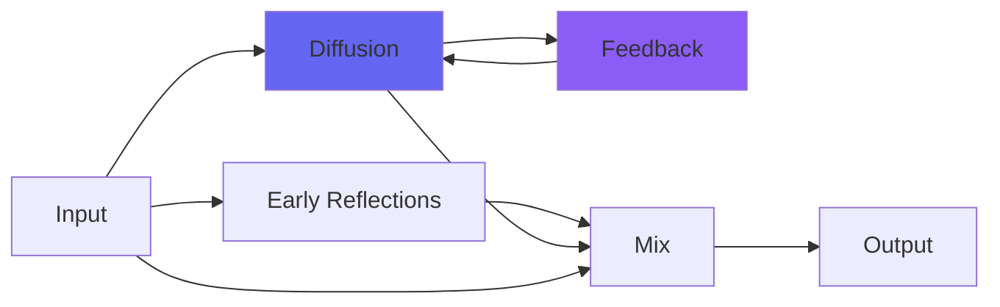

# kPlate240

 

## Quick Info

| | |
|---|---|
| **Category** | Reverb |
| **Type** | Reverb |
| **Status** | Latest Release |

## Description

for the texture of smaller, gold foil reverb

## Detailed Overview

kPlate240 is the result of combining many recent Airwindows developments, with other stuff often too strange to work directly as plugins. Mind you, you can still have plugins like SubTight, the Pear filter and so on, but if I was able to track who was using what, you'd see a million instances of plugins like kPlateA and nobody doing anything with SubTight, and most of the uses of Pear would be inside other plugins like ConsoleMC.

But sometimes, there's a purpose to achieve, and some odd plugin turns out to be able to get the sound, and in this case the purpose was simple. Both the gold-foil 240 plate, and the big 140, do not do damping in the sense a digital reverb does damping (by turning down the regeneration, without which any digital reverb gets very short indeed). Instead, they have a big physical panel that's brought near the vibrating plate, and it couples acoustically with the plate to damp it. But this is far from linear! And it'll be distorting low frequencies preferentially, nonlinearly, and the whole thing will produce a sound that's instantly recognized, but is really a bit of a mess. And it seems to me the gold foil version is all the more messy, even though it's portable. It's this lush cloudy thing, darker, oddly murky, and how would you go about making that sound?

In this case, it's with a custom 5x5 Householder matrix (already an unusual Airwindows technique, and a set of delay times that haven't been used before, with a plate-style delay density), those Pear filters, and SubTight. The development was twitchy, making controls like Regen restricted to a narrower range of adjustment so things wouldn't blow up. And eventually kPlate240 took shape.

This is not the big awesome famous plate reverb, it's a different sound like the gold-foil little brother. The idea is that kPlate240 can be tucked into mix spaces and won't dominate, but will cause a sonic bloom that can be helpful. It's a plate sound that's meant to be used with as much damping as you like: on top of that, as a more modern Airwindows reverb, you can use the DeRez control to both restrict the treble of the reverb, and scale the verb size up (lowering DeRez does both these things). Because DeRez is in play, it will work in consistent ways at any sample rate, even silly high rates: the higher your native DAW sample rate, the more 'steps' you'll get in the DeRez as it reconstructs the waveform using Bezier curves (which I find is an interesting-sounding texture for reverbs).

Predelay gives you plenty of range for 'slapback, only it's a damped plate reverb' sounds. Wetness lets you go from dry, to both at full volume, to all-wet. It sounds surprisingly coherent at full wet, but that's because the damping plate cleans it up a lot. Would a 240 be your only reverb? Perhaps not, but when you can have the option from the click of a mouse, why not? Might not be the gold standard for big reverb, but this should find uses :)

## Signal Flow

## How It Works

kPlate240 creates spatial effects through plate emulation. Use it to add depth, space, and dimension to your tracks.

## Usage Tips

- Less is often more - start conservative
- Use pre-delay for clarity
- EQ the reverb return (cut lows, sometimes highs)
- Match decay time to song tempo

## Related Plugins

Browse other [Reverb](../categories/reverb.md) plugins.

## Technical Details

**Source Code**: [View on GitHub](https://github.com/airwindows/airwindows/tree/master/plugins/LinuxVST/src/kPlate240)

**Categories**: Reverb

**Available Formats**:
- Mac AU
- Mac VST
- Windows VST
- Linux VST

## Resources

- [All Airwindows Plugins](../../README.md)
- [Category: Reverb](../categories/reverb.md)
- [Airwindows Website](https://www.airwindows.com)
- [Airwindows GitHub](https://github.com/airwindows/airwindows)

---

*Part of the Airwindows plugin collection - Open source audio processing plugins*

*Last updated: 2024*
