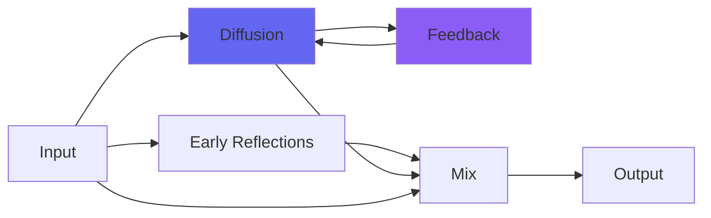

# kPlateA

## Quick Info

| | |
|---|---|
| **Category** | Reverb |
| **Type** | Reverb |
| **Status** | Latest Release |

## Description

a plate reverb, not unlike its namesake atop Abbey Road

## Detailed Overview

So I just happened to turn my efforts to plate reverbs last week, since the internet exploded over some plugin drama and some of the plugins in question just happened to be models of some specific plate reverbs in a famous place: atop Abbey Road Studios. There were four of them, and I'm sure I can't make a plugin to model those exact ones, as the rights to the name are probably all tied up. And I wouldn't suggest that I tried to make reverb plugins MORE realistic than those made by this company with rights to the name. That would be rude! :D

But I bet nothing is stopping me from making plugins and using the LETTER. And indeed nothing is stopping me from finding examples of dry sound and then the sound of these other plugins, and using that as a reference to the lettered EMT plate reverb on top of Abbey Road, or indeed figuring out that this other company rather overprocessed its stuff and finding ways to get a similar effect that's cleaner, deeper and more intense.

It's actually a really interesting puzzle to do this sort of thing… especially when you don't really have good reference yet, as it's all happening so fast. But now you have kPlateA. And in it, you might just have a new best plate reverb. It's using multiple fancy Householder feedforward matrices, all sorts of filtering, undersampling to make it useable at 96k and 192k, and seeing as it was developed on my antique Macbook Pro running Snow Leopard, I daresay it both sounds better and runs better than its competition.

Oh, one more thing: you get to own it. And by that I mean, not only do you get it maintained and supported for free (thanks to a thriving Patreon and those who help me), but it is also MIT-licensed open source code. So you get to own it, in the sense of you can take the code and skin it with a big GUI with pictures of plate reverbs with funny waves drawn on them, if you feel that is really necessary. You just have to credit Airwindows.

Or, you may find that the way this can sit in the mix, means the GUI with pictures of plate reverbs with funny waves drawn on them, isn't really as necessary as you thought it was :)

## Signal Flow

## How It Works

kPlateA creates spatial effects through plate emulation. Use it to add depth, space, and dimension to your tracks.

## Usage Tips

- Less is often more - start conservative
- Use pre-delay for clarity
- EQ the reverb return (cut lows, sometimes highs)
- Match decay time to song tempo

## Related Plugins

Browse other [Reverb](../categories/reverb.md) plugins.

## Technical Details

**Source Code**: [View on GitHub](https://github.com/airwindows/airwindows/tree/master/plugins/LinuxVST/src/kPlateA)

**Categories**: Reverb

**Available Formats**:
- Mac AU
- Mac VST
- Windows VST
- Linux VST

## Resources

- [All Airwindows Plugins](../../README.md)
- [Category: Reverb](../categories/reverb.md)
- [Airwindows Website](https://www.airwindows.com)
- [Airwindows GitHub](https://github.com/airwindows/airwindows)

---

*Part of the Airwindows plugin collection - Open source audio processing plugins*

*Last updated: 2024*
