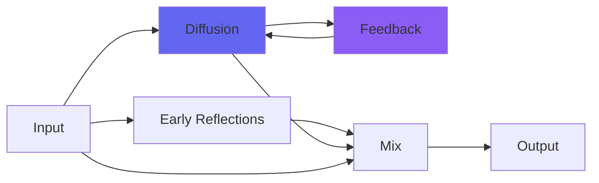

# kPlateB

## Quick Info

| | |
|---|---|
| **Category** | Reverb |
| **Type** | Reverb |
| **Status** | Latest Release |

## Description

a plate reverb, not unlike its namesake atop Abbey Road

## Detailed Overview

In the continuing saga of 'Chris makes plugins in a competitive marketplace', kPlateB is one heck of a statement!

This is the follow-up to the plugin kPlateA, which I've talked about recently. It sought to get the sound of a famous EMT plate reverb on top of a famous recording studio, through study of internet examples of that sound. Turned out to be a little more complicated than that, but who's counting? As a result, you've got kPlateA, and it's a big deep plate reverby sound.

Plate B from that studio is said to be shorter and brighter, and indeed the examples you can find of that sound in plugin form draw the plate in a different color (I believe in the real world they're all big steel objects and none of them are painted nor are any of them the gold foil EMTs, but artistic license) and in other plugins the algorithm's EQed a bit different and the controls give you shorter reverb times.

Airwindows is different.

In kPlateB, as with ALL different reverbs that will ever exist in the 'k' section of Airwindows-land, the fundamental algorithm is different, even the topology and basic code of the verb is different, and notably both of these use the following technique: my studio computer grinds away for hours or days to generate a 3x3 Householder matrix for allpasses that can be used two ways, horizontally and vertically. Same allpass values, but L and R see them in completely different combinations. And then, even more hours and days of grind for a 5x5 Householder matrix that does the delays of the actual reverb, the same way: L and R see completely different combinations in the same matrix which then has the sides crossfeed into each other in a way that's custom for each set of matrices. So the guts of the thing are totally different each time, and will continue to be (technically this means I could make a celebrity a bespoke space for just them to use, but they'd have to make it worth my while to NOT share that data with the open source world ;) )

So, you've got kPlateA, and it sounds big and platey and deep and metallic and not unlike a big ol' plate reverb.

kPlateB sounds not unlike MAGIC.

It really freaked me out in the nicest way, how good this one sounds. Audio put through it just blooms, coming alive and sitting in a wonderful space. It's gonna be a hard act to follow… except that there will be a place for each of these, and a place for more traditional acoustic spaces I come up with later. It just so happens that kPlateB really does the 'envelop sound in a lush, vivid atmosphere' thing really well. I think kPlateA sits back a lot deeper and sounds more old and retro. kPlateD will have to sound even more retro as it models a tube EMT-140, not custom hybrid ones. kPlateC will need to be even shorter and brighter to properly emulate the famous real ones out there. All will have to have custom algorithms and matrices.

I'm doing this as fast as I can, and I think it's coming along quite well. Sky's the limit, really. Hope you enjoy the sound of your new reverb plate as much as I enjoy it, having made it :)

## Signal Flow

## How It Works

kPlateB creates spatial effects through plate emulation. Use it to add depth, space, and dimension to your tracks.

## Usage Tips

- Less is often more - start conservative
- Use pre-delay for clarity
- EQ the reverb return (cut lows, sometimes highs)
- Match decay time to song tempo

## Related Plugins

Browse other [Reverb](../categories/reverb.md) plugins.

## Technical Details

**Source Code**: [View on GitHub](https://github.com/airwindows/airwindows/tree/master/plugins/LinuxVST/src/kPlateB)

**Categories**: Reverb

**Available Formats**:
- Mac AU
- Mac VST
- Windows VST
- Linux VST

## Resources

- [All Airwindows Plugins](../../README.md)
- [Category: Reverb](../categories/reverb.md)
- [Airwindows Website](https://www.airwindows.com)
- [Airwindows GitHub](https://github.com/airwindows/airwindows)

---

*Part of the Airwindows plugin collection - Open source audio processing plugins*

*Last updated: 2024*
