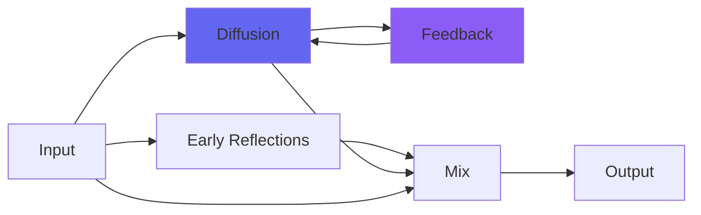

# kPlateC

## Quick Info

| | |
|---|---|
| **Category** | Reverb |
| **Type** | Reverb |
| **Status** | Latest Release |

## Description

a plate reverb, not unlike its namesake atop Abbey Road

## Detailed Overview

Onward with the plate reverbs! kPlateC is an interesting contrast to kPlateB, and an example of how Airwindows k-series reverbs work. Since there's no GUI you can't be fooled by different visual depiction of the two plates, so they're exposed as just sound. These are meant to resemble real things, and the real Plate C is said to be even shorter and brighter than the real Plate B. This is on top of them all having an array of controls (I've been asked to flip Damping over so higher numbers equal more damping, but that would apparently be contrary to how the real ones are laid out, not that you're likely to go to London and see… nor I, for that matter, though it would be fun)

Since kPlateB came out very nicely, how is kPlateC different?

Obviously it's voiced a bit differently to match the real one, but unlike other plugin approaches, the Airwindows plates each run completely different reverb matrix algorithms. I'm not talking about things like saturations etc (though kPlateD, being a tube reverb, has to have completely different software for that than A, B and C which are  hybrid circuitry). What I mean is, all the little delays inside are different (normally so tricky that you come up with one great algo and then adapt that to each flavor of plate).

And so, kPlateC is like kPlateB and yet completely different. The room, the space it makes is shallower, wider, a different shape. There will be things where it works way better than kPlateB, and vice versa, because they're just plain different flavors. If a note resonates on one plate, its brother is going to act completely different and won't highlight that note at all.

This will be the case for the whole k-series of reverbs as they expand. Hope you like it. Back to work :)

## Signal Flow

## How It Works

kPlateC creates spatial effects through plate emulation. Use it to add depth, space, and dimension to your tracks.

## Usage Tips

- Less is often more - start conservative
- Use pre-delay for clarity
- EQ the reverb return (cut lows, sometimes highs)
- Match decay time to song tempo

## Related Plugins

Browse other [Reverb](../categories/reverb.md) plugins.

## Technical Details

**Source Code**: [View on GitHub](https://github.com/airwindows/airwindows/tree/master/plugins/LinuxVST/src/kPlateC)

**Categories**: Reverb

**Available Formats**:
- Mac AU
- Mac VST
- Windows VST
- Linux VST

## Resources

- [All Airwindows Plugins](../../README.md)
- [Category: Reverb](../categories/reverb.md)
- [Airwindows Website](https://www.airwindows.com)
- [Airwindows GitHub](https://github.com/airwindows/airwindows)

---

*Part of the Airwindows plugin collection - Open source audio processing plugins*

*Last updated: 2024*
