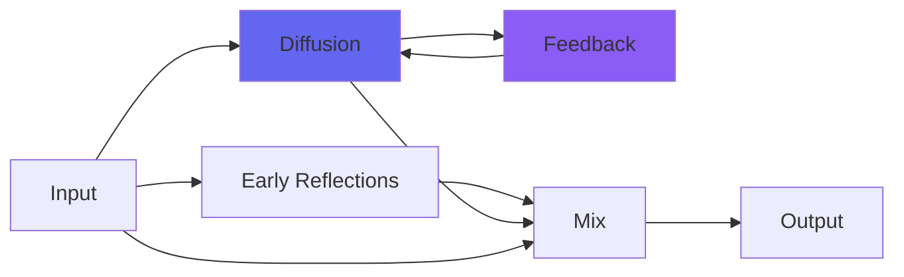

# kPlateD

## Quick Info

| | |
|---|---|
| **Category** | Reverb |
| **Type** | Reverb |
| **Status** | Latest Release |

## Description

a plate reverb, not unlike its namesake atop Abbey Road

## Detailed Overview

We're not done, but we're done with the lettered plate reverbs not unlike certain ones in a famous studio! And we're ending with a banger. This is kPlateD. This is the one that wasn't modified to run with hybrid circuitry, though it's still got the circuitry removed from the box to lower noise (ok, easier to do that with a plugin: I'm literally not putting fake mains hum or anything, in). This is the all-tube one.

Just listen, and compare it with the others, notably kPlateA which is also more of a 'long deep' plate.

You're not going to get the sheer scale of the difference off competing plugins, and these are free open source and if fixes are ever needed everyone will get fixes or updates for free, forever, with source code so you could maintain it yourself: how much is that worth to you? Probably not as much as being extorted for software, because people will always pay more money if they're backed into a corner and forced to. But you know, I don't need ALL of the money from all of the people. Just enough to live, and buy a Neve console to put in my home :) (just kidding)

So even though it's purely software, the tube circuitry is plainly obvious as a contrast to the other three with their hybrid sound. How is this done? Partly through tuning everything (and selecting the actual reverb matrices) to suit the target sound. And partly through literally coding each of them a little differently, with kPlateD being by far the most distinct, its internal saturation algorithms being a whole different type.

So if I can do this, why didn't I do it with kPlateA, B and C? For the same reason the Beatles album Abbey Road and the Pink Floyd album Dark Side of the Moon wouldn't automatically be better if they were cut on the old REDD consoles. Each sound serves a purpose. They convey distinct atmospheres, which your ear can learn and remember, so rather than struggling to adapt all manner of strange controls you can do 'this should have kPlateB' and then concentrate on what music's meant to go into it. Hope you enjoy the atmosphere of the classic kPlateD :)

## Signal Flow

## How It Works

kPlateD creates spatial effects through plate emulation. Use it to add depth, space, and dimension to your tracks.

## Usage Tips

- Less is often more - start conservative
- Use pre-delay for clarity
- EQ the reverb return (cut lows, sometimes highs)
- Match decay time to song tempo

## Related Plugins

Browse other [Reverb](../categories/reverb.md) plugins.

## Technical Details

**Source Code**: [View on GitHub](https://github.com/airwindows/airwindows/tree/master/plugins/LinuxVST/src/kPlateD)

**Categories**: Reverb

**Available Formats**:
- Mac AU
- Mac VST
- Windows VST
- Linux VST

## Resources

- [All Airwindows Plugins](../../README.md)
- [Category: Reverb](../categories/reverb.md)
- [Airwindows Website](https://www.airwindows.com)
- [Airwindows GitHub](https://github.com/airwindows/airwindows)

---

*Part of the Airwindows plugin collection - Open source audio processing plugins*

*Last updated: 2024*
