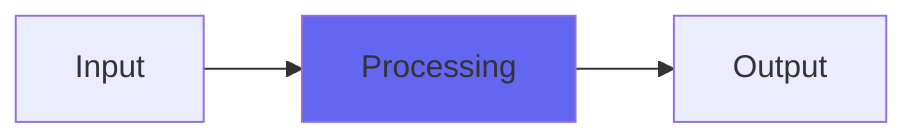

# LilAmp

## Quick Info

| | |
|---|---|
| **Category** | Amp Sims |
| **Type** | Amp Sims |
| **Status** | Latest Release |

## Description

a tiny amp sim, like a little bitty practice amp without that much gain

## Detailed Overview

Here’s a cute little monster for you! LilAmp is an alternate take on my amp sims (resurrected from way back when, and brought up to speed to some extent). Unlike something like FireAmp or GrindAmp, this one’s much lower gain and acts like little practice amps, but the kind with a lot of loudness and sonority.

You use this when you want more of a clean, articulate effect, or when you’re trying to highlight the treble and midrange (for instance, for leads, or to turn a snare into a loud, confined whack). You can make it be more mellow, too, but it will always be ‘LilAmp’ and speak up in a certain way. Something I found it useful for, is rhythm guitar that’s kind of Stonesy and not all that saturated: you can get the right kind of midrange bark out of it.

All these amp sims (there are more coming, too!) incorporate the cab sim stuff I’d also done back in the day, and they all have a rather special dry/wet control where backing off the full-wet sound gives you two stages of dry/wet, one for the cab sim and one for the amp sim. So things clean up in a distinctive way that’s not like any other plugin, or anything you could get out of a real amp, for that matter. Treat LilAmp as a flexible way to get this type of sound, because it’s way more interested in doing that, than in trying to mimic any particular literal amp. Rather than taking a real amp and EQing and shaping it to your mix, you take LilAmp and morph it directly until it does what’s needed (this applies to the other Airwindows amp sim plugins, too).

## Signal Flow

## How It Works

LilAmp processes audio in the Amp Sims category. See the description above for specific functionality.

## Usage Tips

- Start with conservative settings
- A/B compare to hear the effect clearly
- Use in context with other processing
- Trust your ears over visual meters

## Related Plugins

Browse other [Amp Sims](../categories/amp-sims.md) plugins.

## Technical Details

**Source Code**: [View on GitHub](https://github.com/airwindows/airwindows/tree/master/plugins/LinuxVST/src/LilAmp)

**Categories**: Amp Sims

**Available Formats**:
- Mac AU
- Mac VST
- Windows VST
- Linux VST

## Resources

- [All Airwindows Plugins](../../README.md)
- [Category: Amp Sims](../categories/amp-sims.md)
- [Airwindows Website](https://www.airwindows.com)
- [Airwindows GitHub](https://github.com/airwindows/airwindows)

---

*Part of the Airwindows plugin collection - Open source audio processing plugins*

*Last updated: 2024*
