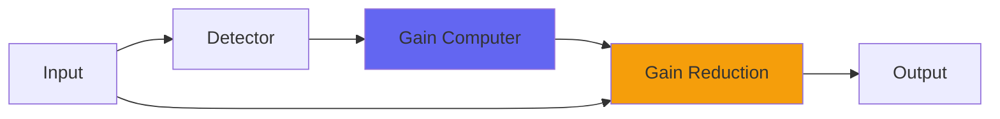

# Logical4

## Quick Info

| | |
|---|---|
| **Category** | Dynamics |
| **Type** | Dynamics |
| **Status** | Latest Release |

## Description

a classic 2-buss compressor

## Detailed Overview

Logical’s a compressor. It was designed from the start to work on the 2-buss in the most demanding conditions: people are really picky about their 2-buss compressors, and you can’t mess around. The tone has to be spot-on and it’s got to be transparent and able to let the music through. Additionally, when we’re talking about ‘tone’ and something called ‘Logical’ you can see that it’s going to be in the SSL style: there’s a sparkliness which requires some extra coding attention.

You can approach compression duties from several directions with Logical. It has three distinct stages, and will entirely bypass stages it’s not using. It’ll go from 1/1 compression, up to 2/1 using just a single stage (for the utmost transparency): keep it below 2/1 ratio and use the threshold control to bring in the compression. This is a traditional 2-buss natural-sounding compression. From 2/1 to 4/1 ratio, you can get various behaviors and the two stages in use still sound very clean: the speed control will give you different kinds of ‘swing’ and spring-back out of the compression.

Then as you pass 4/1 ratio and go off to a max of 16/1 (approximate, but that’s the basic idea) there’s a tone change, and as you get into crazy high ratios, Logical goes a little bonkers. This was NOT available in previous Logicals. The issue was, if you rely heavily on that final compression stage, things can get messy. You can push Logical until it’s nasty and so full of energy it’s forcing you to use the makeup gain to PAD the output, just to handle all the madness.

This time, and in honor of Logical going free VST format, it’s not set up for only good behavior. This time, it’s your responsibility to not blow up your outputs by thoughtlessly cranking the ratio. Consider it an audio chainsaw made of silk and glorious victories. Not every top-selling plugin got this much better when I revisited it. I’m very pleased with how Logical4 came out, and I hope to see it talked about a whole bunch. This one’s worth a lot of ‘did you hear?’.

## Signal Flow

## How It Works

Logical4 controls dynamics through peak control. The algorithm responds to your audio in a musical way, providing transparent to aggressive dynamic control.

## Usage Tips

- Start with gentle settings and increase as needed
- Use Dry/Wet for parallel compression if available
- Listen for pumping or artifacts
- A/B bypass to check if processing helps the mix

## Related Plugins

Browse other [Dynamics](../categories/dynamics.md) plugins.

## Technical Details

**Source Code**: [View on GitHub](https://github.com/airwindows/airwindows/tree/master/plugins/LinuxVST/src/Logical4)

**Categories**: Dynamics

**Available Formats**:
- Mac AU
- Mac VST
- Windows VST
- Linux VST

## Resources

- [All Airwindows Plugins](../../README.md)
- [Category: Dynamics](../categories/dynamics.md)
- [Airwindows Website](https://www.airwindows.com)
- [Airwindows GitHub](https://github.com/airwindows/airwindows)

---

*Part of the Airwindows plugin collection - Open source audio processing plugins*

*Last updated: 2024*
