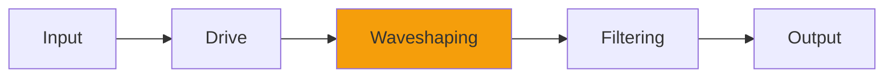

# Loud

## Quick Info

| | |
|---|---|
| **Category** | Distortion |
| **Type** | Distortion |
| **Status** | Latest Release |

## Description

distortion and demolition of air molecules, modeled

## Detailed Overview

Here’s something rather special. What if you could distort like air molecules distort?

I studied recordings of competitive tractor pulls, of Space Shuttle launches, various recordings that represented the way air can be mangled and break apart. The result is Loud… a step into a much louder world. It’s a distortion that can be slammed to unthinkable ‘heart of a supernova’ dB levels, but can also be subtly introduced to give the sonic coloration of a big LOUD noise in open air. Makes for a very interesting ‘glue’ at zero boost!

Here’s how it’s done: rather than apply a consistent transfer function like a normal distortion, Loud knows whether you’re compressing the air, or letting it rebound. And if it’s snapping back, it can do it with the speed of lightning, but if it’s compressing, the air can be squished to practically solid, increasing heat. This extreme nonlinearity is why Loud sounds the way it does. It can sit on a whole mix to give it scope and authority, or it can be pushed harder on individual tracks like guitars and drums to amp up the ferocity.

Remember, if you’ve got it totally fuzzing out, you are probably already beyond any sound level achievable by human means. The completely fried sound of cranked-up Loud is not meant to seem like acoustic phenomena as we know it. It turns up that loud because I grew up reading Douglas Adams’ “Hitchhiker’s Guide to the Galaxy”, and because in no other way can you accurately emulate a Disaster Area concert. :)

## Signal Flow

## How It Works

Loud adds harmonics and edge through distortion. Use it for adding grit, warmth, or aggressive processing.

## Usage Tips

- Start with conservative settings
- A/B compare to hear the effect clearly
- Use in context with other processing
- Trust your ears over visual meters

## Related Plugins

Browse other [Distortion](../categories/distortion.md) plugins.

## Technical Details

**Source Code**: [View on GitHub](https://github.com/airwindows/airwindows/tree/master/plugins/LinuxVST/src/Loud)

**Categories**: Distortion

**Available Formats**:
- Mac AU
- Mac VST
- Windows VST
- Linux VST

## Resources

- [All Airwindows Plugins](../../README.md)
- [Category: Distortion](../categories/distortion.md)
- [Airwindows Website](https://www.airwindows.com)
- [Airwindows GitHub](https://github.com/airwindows/airwindows)

---

*Part of the Airwindows plugin collection - Open source audio processing plugins*

*Last updated: 2024*
