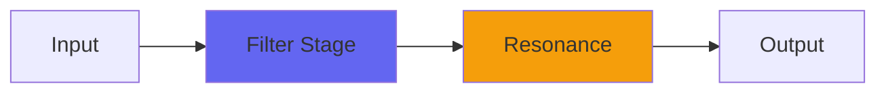

# Lowpass2

## Quick Info

| | |
|---|---|
| **Category** | Filter |
| **Type** | Filter |
| **Status** | Latest Release |

## Description

an unusual-sounding variable-slope lowpass filter

## Detailed Overview

This new version of Lowpass exists to fix a bug, but then I added stuff to it that makes it entirely a new animal!

The existing Lowpass tries to produce the same cutoff no matter what sample rate you use, but doing that meant high sample rates can never use a fully opened filter. Instead, you got roll-off no matter what. Lowpass2 no longer does that: the filter control goes from complete silence to wide open no matter what sample rate you’re at.

But there’s more: Lowpass2 still uses the interleaved IIR filters the original Lowpass pioneered (you’ll notice subtle bleed-through of information near the Nyquist frequency, beyond human hearing, but also the open and involving sound) but now it can use from zero to four poles of filter: so you get a stronger effect, and a sharper roll-off!

And that’s important because with four poles of filter you REALLY hear what the Soft/Hard slider does. This interacts with the filter control (don’t expect the cutoff frequency to stay the same) but what it does is vary the cutoff based on what sample value the input is. So you can either roll off harder for the peaks of the sound… or let ’em through more. Since it’s an IIR filter the effect is gradual, but at four poles it’s really noticeable.

That gives you two distinct tone colors for your lowpassing, plus special effects: in the video I demonstrate how cranking the control to Hard on pink noise can make it sound like wind noise where you’re going incredibly fast. Lowpass2 is ideal for experimental tone shaping, and for sound design.

## Signal Flow

## How It Works

Lowpass2 shapes frequencies through filtering. Use it for tone shaping, problem solving, or creative sound design.

## Usage Tips

- Make small adjustments - EQ is powerful
- Cut first, boost second (if needed)
- Check your changes in context with the full mix
- Use solo to identify problem frequencies

## Related Plugins

Browse other [Filter](../categories/filter.md) plugins.

## Technical Details

**Source Code**: [View on GitHub](https://github.com/airwindows/airwindows/tree/master/plugins/LinuxVST/src/Lowpass2)

**Categories**: Filter

**Available Formats**:
- Mac AU
- Mac VST
- Windows VST
- Linux VST

## Resources

- [All Airwindows Plugins](../../README.md)
- [Category: Filter](../categories/filter.md)
- [Airwindows Website](https://www.airwindows.com)
- [Airwindows GitHub](https://github.com/airwindows/airwindows)

---

*Part of the Airwindows plugin collection - Open source audio processing plugins*

*Last updated: 2024*
