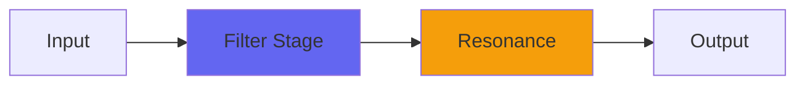

# MackEQ

## Quick Info

| | |
|---|---|
| **Category** | Filter |
| **Type** | Filter |
| **Status** | Latest Release |

## Description

the Mackie distortion but with treble and bass controls added

## Detailed Overview

Folks who wanted Mackity, were looking to do some crazy things with it. We’re taking an old Mackie 1202, pre-VLZ (I have one and know how to abuse it for effect) and we’re mangling sounds with it. People wanted to take a kick drum, run it through one channel turned all the way up, patch that to another channel with crazy EQ and also turned up until ready to explode, and so on. Mackity was my best shot at just the input section of the 1202, with all the gain on tap but set up to work as close to ‘clean’ as these desks ever got: more so, in fact, as it doesn’t add hiss and chip noise. Mackity was really good at sounding exactly like that, for those who like patching out of the insert points and getting a reasonably hi-fi sound out of their old 90s mixer.

There are plenty of people who know without the shadow of a doubt, that the very idea is ridiculous: that, compared to your Neves and APIs etc, these tiny budget mixers are garbage.

They will HATE this plugin. This is the same thing only with the garbage EQs in the 1202, the original two-band version, in which you can also overdrive the op-amps inside the EQs for good measure. Nothing about this sounds nice. You might want to pad down the output if you try: it’s pretty horrifying.

Some folks will go and immediately do that… and some of those, are very used to their original Mackie analog mixers, and know the exact tone they should get. And I can’t tell you whether those folks will be happy with MackEQ, because I have the real one (not an 8-buss, but a 1202) to compare with, and I did not get a perfect exact clone. I got something else. I think it might be useful: certainly it can get the correct TYPE of tone, but I don’t believe I have the true 100% 90s drum and bass madness exactly down. There’s a texture in there, especially when you start aggressively distorting highs, that just defies being captured in a plugin, much like you don’t really get a Marshall Plexi in the box.

But I captured SOMETHING in a plugin, and it’s in the ballpark. If you can accept a slight re-voicing of the thing, or if your use of it doesn’t involve torturing hi-hats and such in the first place, you might find MackEQ is useful to you. That’s my hope. I daresay I’ll find uses for it myself… including, use after certain secret projects I’m still working on. Seems I’ve devoted myself to the DnB flame. If only I could play the music, I’d really be on to something :)

## Signal Flow

## How It Works

MackEQ shapes frequencies through EQ. Use it for tone shaping, problem solving, or creative sound design.

## Usage Tips

- Make small adjustments - EQ is powerful
- Cut first, boost second (if needed)
- Check your changes in context with the full mix
- Use solo to identify problem frequencies

## Related Plugins

Browse other [Filter](../categories/filter.md) plugins.

## Technical Details

**Source Code**: [View on GitHub](https://github.com/airwindows/airwindows/tree/master/plugins/LinuxVST/src/MackEQ)

**Categories**: Filter

**Available Formats**:
- Mac AU
- Mac VST
- Windows VST
- Linux VST

## Resources

- [All Airwindows Plugins](../../README.md)
- [Category: Filter](../categories/filter.md)
- [Airwindows Website](https://www.airwindows.com)
- [Airwindows GitHub](https://github.com/airwindows/airwindows)

---

*Part of the Airwindows plugin collection - Open source audio processing plugins*

*Last updated: 2024*
