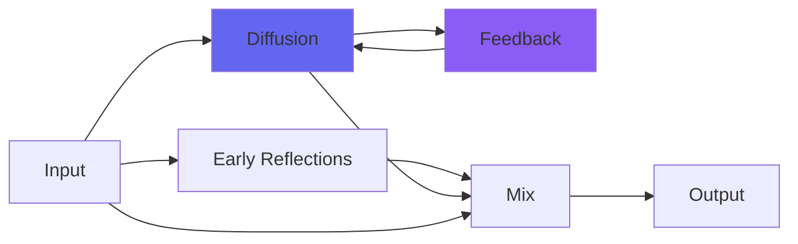

# MatrixVerb

## Quick Info

| | |
|---|---|
| **Category** | Reverb |
| **Type** | Reverb |
| **Status** | Latest Release |

## Description

a wildly adjustable, strangely colorful reverb for deep and flexible spaces

## Detailed Overview

First, the Swiss Army Knife reverb! (a more cooperative one is to follow)

This is the result of some deep diving into Householder reverb algorithms (a way of taking four delay lines and turning them into infinite reverb). It’s different from anything I’ve done before, reverb-wise: extremely flexible, and incorporating some neat new tricks (for instance, the highs fall away at the same rate they would in a giant concrete cavern, allowing for REALLY huge-sounding spaces as well as convincing smaller spaces). It’s actually two parallel Householder reverbs in the place of one.

But what would happen if you had them feed back into each other, not just into themselves?

Turns out two different things can happen. One is a twisting and distorting of the sonic space into a distinctly… SPRING-like tonality. If you push the flavor knob towards 1.0, you increasingly get that clangy spring reverb thing, either subtly or overbearingly.

The other is this: apparently the opposite of a spring is a plate. Because when the Householder tanks feed back into each other inverted, they cancel out those same things and produce a whonging booming dense solidness that I remember, very well, from building a REAL plate reverb out of a big sheet of steel hanging from springs. I should say that real one I built was not a GOOD plate reverb… but I remember what it was like, and I can bring back the feel of it with this strange beast and its inverted broken feedback thing. This is one of those Airwindows plugins that lets you cut off your own foot with giddy abandon: all the bad settings are totally available. But if you know how to tune it, you might get something quite magical.

You get damping (from ‘almost’ infinite reverb down to very very damped), an overall tone control to handle whether the verb is bright or not, the ‘flavor’ control that leans either platey or springy or neutral, a room size that will go unreasonably huge even at 96k, and dry/wet. Stay tuned for stuff that’s more ‘preset’ and always gives you useful/good settings: that’s coming too. But this one is the reverb of doom: the most wild range of settings and tonalities and spaces, and the neat thing is apart from the global tone control at top, it’s all about manipulating the heart of the algorithm in significant ways. None of the adjustments are arbitrary: for the range of useful tonality, this reverb is very simple to operate.

## Signal Flow

## How It Works

MatrixVerb creates spatial effects through algorithmic reverb. Use it to add depth, space, and dimension to your tracks.

## Usage Tips

- Less is often more - start conservative
- Use pre-delay for clarity
- EQ the reverb return (cut lows, sometimes highs)
- Match decay time to song tempo

## Related Plugins

Browse other [Reverb](../categories/reverb.md) plugins.

## Technical Details

**Source Code**: [View on GitHub](https://github.com/airwindows/airwindows/tree/master/plugins/LinuxVST/src/MatrixVerb)

**Categories**: Reverb

**Available Formats**:
- Mac AU
- Mac VST
- Windows VST
- Linux VST

## Resources

- [All Airwindows Plugins](../../README.md)
- [Category: Reverb](../categories/reverb.md)
- [Airwindows Website](https://www.airwindows.com)
- [Airwindows GitHub](https://github.com/airwindows/airwindows)

---

*Part of the Airwindows plugin collection - Open source audio processing plugins*

*Last updated: 2024*
