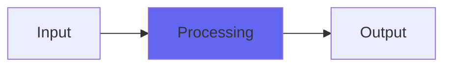

# Melt

## Quick Info

| | |
|---|---|
| **Category** | Ambience |
| **Type** | Ambience |
| **Status** | Latest Release |

## Description

a wobbly chorusy weird diffuse effect

## Detailed Overview

As useful as utility plugins are, sometimes you just have to do something wobbly and weird. Here’s Melt!

To explain what it’s doing will be a little tricky. You can just download it and play with it, but if you want to know what’s under the hood, here goes.

Suppose you have a delay buffer. You can read ‘echoes’ out of the delay buffer. If you like, you can move them around, which changes their pitch.

What if you started reading at one point, and stopped at another? You’d get a delayed ‘moving average’, a series of samples combined. It would be duller, rolled-off.

If you took that section and moved IT, then you’d have a rolled-off, darker delay tap that changed pitch.

Now, what if you took all the start points and all the end points, and made them all wobble and sway around independently, so that the shifting delay taps also changed in tone color and volume even while they pitch-shifted around?

Well, that’s Melt. It’s pretty freaky, when cranked way up. You can run a long extended delay, causing it to resemble a strange retro ambience effect, or you can tighten it right up so that you have more of a chorusy thing. It probably should always have a bunch of pitch shift depth, otherwise it’s a mite boring. You can include dry, or just crank up the wobbly weirdness: should be nice on pads and things, or anything that has to be more dark and diffuse and unpredictable.

## Signal Flow

## How It Works

Melt processes audio in the Ambience category. See the description above for specific functionality.

## Usage Tips

- Start with conservative settings
- A/B compare to hear the effect clearly
- Use in context with other processing
- Trust your ears over visual meters

## Related Plugins

Browse other [Ambience](../categories/ambience.md) plugins.

## Technical Details

**Source Code**: [View on GitHub](https://github.com/airwindows/airwindows/tree/master/plugins/LinuxVST/src/Melt)

**Categories**: Ambience

**Available Formats**:
- Mac AU
- Mac VST
- Windows VST
- Linux VST

## Resources

- [All Airwindows Plugins](../../README.md)
- [Category: Ambience](../categories/ambience.md)
- [Airwindows Website](https://www.airwindows.com)
- [Airwindows GitHub](https://github.com/airwindows/airwindows)

---

*Part of the Airwindows plugin collection - Open source audio processing plugins*

*Last updated: 2024*
