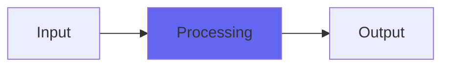

# Monitoring2

## Quick Info

| | |
|---|---|
| **Category** | Utility |
| **Type** | Utility |
| **Status** | Stable |

## Description

Monitoring, but with Dark as the wordlength reducer

## Detailed Overview

Here’s a little update for users of Monitoring! Monitoring is the end-of-2-buss plugin that allows you to check your mix in lots of different ways. You can get 24 or 16 bit output out of it (as in, direct to CD format for saving as 16 bit), lots of reference sounds like SubsOnly, SlewOnly, PeaksOnly that will let you hear your mix in a very different way (if it’s way out of balance when you can only hear the deepest subs, or the brightest highs, you can re-adjust things.) PeaksOnly shows you a fake and unnatural sound that will enhance the inaudible peak energy and highlight anything that might be too loud because it’s heavy on peak energy. You’ve got four variations on Cans for headphone mixing (which gives you crossfeed in the form of allpassed, blurred audio a bit like what PeaksOnly does), you’ve got mono and side checks, narrowed-bandwidth checks like Aurat (including one-side mono versions to more closely resemble use of a real mono mix-check speaker) and even utilities like VoiceTrick, which gives you mono with one speaker out of phase: position a mic exactly between the speakers and you can lay vocal tracks without headphones if you need to (not perfect, but it should work).

In short, Monitoring, but with one little change. Everything is the same, but now Monitoring2 uses Airwindows Dark for the wordlength reducer. This is different from the original Not Just Another Dither, in that it will give you deeper blacks in your silences and darker, warmer tones than the original NJAD would do. Dark is not really a dither: it makes its choices (for wordlength reducing) based only on what will create less hiss, noise and highs in the final output. This won’t be right for everybody, and is subtle no matter who you are, but it might be just the thing if you have a retro aesthetic, are into the whole cassette-release scene, or just want to produce music that sounds as unlike the modern DAW scene as you can get.

## Signal Flow

## How It Works

Monitoring2 processes audio in the Utility category. See the description above for specific functionality.

## Usage Tips

- Start with conservative settings
- A/B compare to hear the effect clearly
- Use in context with other processing
- Trust your ears over visual meters

## Related Plugins

Browse other [Utility](../categories/utility.md) plugins.

## Technical Details

**Source Code**: [View on GitHub](https://github.com/airwindows/airwindows/tree/master/plugins/LinuxVST/src/Monitoring2)

**Categories**: Utility

**Available Formats**:
- Mac AU
- Mac VST
- Windows VST
- Linux VST

## Resources

- [All Airwindows Plugins](../../README.md)
- [Category: Utility](../categories/utility.md)
- [Airwindows Website](https://www.airwindows.com)
- [Airwindows GitHub](https://github.com/airwindows/airwindows)

---

*Part of the Airwindows plugin collection - Open source audio processing plugins*

*Last updated: 2024*
