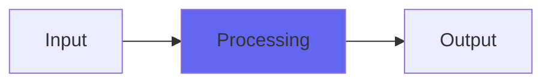

# Neverland

## Quick Info

| | |
|---|---|
| **Category** | Tone Color |
| **Type** | Tone Color |
| **Status** | Stable |

## Description

a re-release of my old Neve-style color adder, exacly as it was

## Detailed Overview

Neverland is my old Neve emulation from 2007. It’s out of the Character collection, and I’m re-releasing these in 64 bit and VST because there are people asking me to do that. If I make it exactly like how it was, you can open old mixes and retain the settings you had, so the Character plugins are kept exactly the same (though they do get denormalization fixes, and the dithering to 32 bit floating point where applicible).

## Signal Flow

## How It Works

Neverland processes audio in the Tone Color category. See the description above for specific functionality.

## Usage Tips

- Start with conservative settings
- A/B compare to hear the effect clearly
- Use in context with other processing
- Trust your ears over visual meters

## Related Plugins

Browse other [Tone Color](../categories/tone-color.md) plugins.

## Technical Details

**Source Code**: [View on GitHub](https://github.com/airwindows/airwindows/tree/master/plugins/LinuxVST/src/Neverland)

**Categories**: Tone Color

**Available Formats**:
- Mac AU
- Mac VST
- Windows VST
- Linux VST

## Resources

- [All Airwindows Plugins](../../README.md)
- [Category: Tone Color](../categories/tone-color.md)
- [Airwindows Website](https://www.airwindows.com)
- [Airwindows GitHub](https://github.com/airwindows/airwindows)

---

*Part of the Airwindows plugin collection - Open source audio processing plugins*

*Last updated: 2024*
