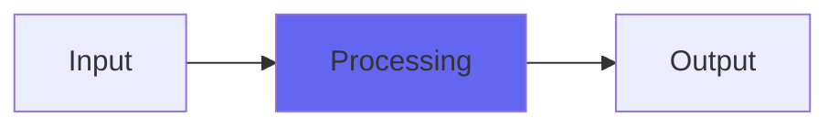

# Nikola

## Quick Info

| | |
|---|---|
| **Category** | Effects |
| **Type** | Effects |
| **Status** | Latest Release |

## Description

an Audio Tesla Coil plugin! Note: audio tesla coils don't sound nice

## Detailed Overview

Sorry/not sorry!

Nikola was, I think, an April Fool’s plugin back in the day. In porting it to VST and making it available for the first time on Windows and Linux, I thought up some improvements, so its Voltage control now combines two different effects: at low Voltage it’s brighter and airier with little roar and sustaining industrial scrunch. At high voltage it goes more midrangey and turns into a complete disaster area.

An audio Tesla Coil fires bolts of lightning at audio rate. This is based off real recordings of such a coil, but the thing is it’s like trying to record fireworks: if you use good mics you just get a ‘pop’ because mics don’t react the way our ears do. So, for the full effect, turn Voltage way up and run it into a lot of distortion and reverb.

Or, you can use it to mangle individual tracks in a really industrial way: it’s a bit unpredictable what you’ll get, but the concept is of firing off impulse responses. But firing off lots of impulses gives you a convolution reverb: this is different, it retriggers the ‘zap’ at every zero crossing causing a different effect.

It’s a legacy plugin based on old experiments, so it doesn’t adapt to sample rates: in the video I’m running it at 96K which makes it sound different. If you’re at 192k it might be too pitch-shifted to be useful (though it’ll track the notes in the underlying track without issue). It’s useless to oversample this plugin, for this reason. If you can somehow undersample it that might be neat? Definitely one for the sound designers.

## Signal Flow

## How It Works

Nikola processes audio in the Effects category. See the description above for specific functionality.

## Usage Tips

- Start with conservative settings
- A/B compare to hear the effect clearly
- Use in context with other processing
- Trust your ears over visual meters

## Related Plugins

Browse other [Effects](../categories/effects.md) plugins.

## Technical Details

**Source Code**: [View on GitHub](https://github.com/airwindows/airwindows/tree/master/plugins/LinuxVST/src/Nikola)

**Categories**: Effects

**Available Formats**:
- Mac AU
- Mac VST
- Windows VST
- Linux VST

## Resources

- [All Airwindows Plugins](../../README.md)
- [Category: Effects](../categories/effects.md)
- [Airwindows Website](https://www.airwindows.com)
- [Airwindows GitHub](https://github.com/airwindows/airwindows)

---

*Part of the Airwindows plugin collection - Open source audio processing plugins*

*Last updated: 2024*
