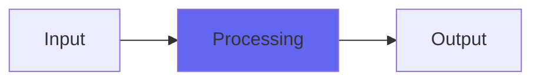

# Noise

## Quick Info

| | |
|---|---|
| **Category** | Noise |
| **Type** | Noise |
| **Status** | Latest Release |

## Description

the Airwindows deep noise oscillator, as a sound reinforcer

## Detailed Overview

Noise started out as a plugin called Voice Of The Starship. It’s an algorithm that generates brownian-motion noise which won’t ‘wander’ into excessive DC offset, but without a highpass filter needed! The original Voice Of The Starship can be made to do any sort of deep rumble, including purely subsonic rumble that still works as an audio stream.

Noise is like Voice Of The Spaceship, except it also triggers on input sounds. It can pretty closely track rhythms coming in, and you can combine it with underlying stuff with Dry/Wet, and the Distance control applies to both Dry AND Wet, to blend and darken them together.

## Signal Flow

## How It Works

Noise processes audio in the Noise category. See the description above for specific functionality.

## Usage Tips

- Start with conservative settings
- A/B compare to hear the effect clearly
- Use in context with other processing
- Trust your ears over visual meters

## Related Plugins

Browse other [Noise](../categories/noise.md) plugins.

## Technical Details

**Source Code**: [View on GitHub](https://github.com/airwindows/airwindows/tree/master/plugins/LinuxVST/src/Noise)

**Categories**: Noise

**Available Formats**:
- Mac AU
- Mac VST
- Windows VST
- Linux VST

## Resources

- [All Airwindows Plugins](../../README.md)
- [Category: Noise](../categories/noise.md)
- [Airwindows Website](https://www.airwindows.com)
- [Airwindows GitHub](https://github.com/airwindows/airwindows)

---

*Part of the Airwindows plugin collection - Open source audio processing plugins*

*Last updated: 2024*
