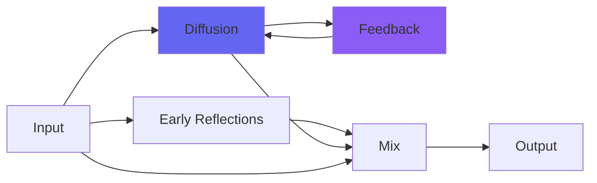

# NonlinearSpace

 

## Quick Info

| | |
|---|---|
| **Category** | Reverb |
| **Type** | Reverb |
| **Status** | Latest Release |

## Description

a flexible reverb plugin

## Detailed Overview

Nonlinear Space is special because it’s got filter controls and acoustic space simulation in the loops: the usual allpasses and comb filters are just a little different here, designed to produce a deeper sound that’ll blend into the mix better. It’s the peak (so far) of all my efforts with reverb, it has its own sound, and it’s free Mac/Windows/Linux AU/VST!

It’s also got a nonlinearity control, which besides the easter egg polymorph duties can do two things: one, it can make louder sounds sustain longer. This is a bit tricky to set up and you’ll want to feed it with consistent loudness, but you can get that ‘sort of 80s gated’ sound if you set it just right, especially if you’re driving it from just a snare track or something sparse like that. Two, it can make louder sounds sustain less, which is the opposite. Using it that way lets you set it up as a reverb bed which doesn’t die away, but you can replace the stuff in it by overlaying more sounds. It’s the opposite of the first nonlinearity but it might come in handy for ambient purposes.

The sample rate thing really just tells it what buffer lengths to use: shorter buffers make tighter spaces. It should give a roughly consistent sound if you use the buffer corresponding to your sample rate, but then you can also be at 44.1K and set it to 96K just to have a huge stadium soundscape. Half the fun here is using it inappropriately, so I wouldn’t dream of telling you how to use Nonlinear Space: I hope it’s easy to get normal sounds with, and for everything else, just have fun.

## Signal Flow

## How It Works

NonlinearSpace creates spatial effects through algorithmic reverb. Use it to add depth, space, and dimension to your tracks.

## Usage Tips

- Less is often more - start conservative
- Use pre-delay for clarity
- EQ the reverb return (cut lows, sometimes highs)
- Match decay time to song tempo

## Related Plugins

Browse other [Reverb](../categories/reverb.md) plugins.

## Technical Details

**Source Code**: [View on GitHub](https://github.com/airwindows/airwindows/tree/master/plugins/LinuxVST/src/NonlinearSpace)

**Categories**: Reverb

**Available Formats**:
- Mac AU
- Mac VST
- Windows VST
- Linux VST

## Resources

- [All Airwindows Plugins](../../README.md)
- [Category: Reverb](../categories/reverb.md)
- [Airwindows Website](https://www.airwindows.com)
- [Airwindows GitHub](https://github.com/airwindows/airwindows)

---

*Part of the Airwindows plugin collection - Open source audio processing plugins*

*Last updated: 2024*
