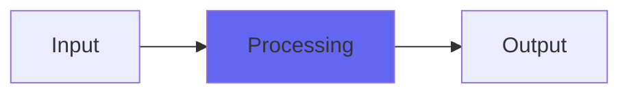

# Pafnuty2

## Quick Info

| | |
|---|---|
| **Category** | Effects |
| **Type** | Effects |
| **Status** | Latest Release |

## Description

a Chebyshev filter, that adds harmonics, and fits in the VCV Rack port

## Detailed Overview

Pafnuty is a Chebyshev filter. What are those? Well, it’s not much like your usual filter: you don’t use this to roll off highs or lows (though under some conditions you might be able to do any of those things). A Chebyshev filter is like a mathematical formula. It works like this: if you feed it a sine wave (at exactly 0dB, or barely-clipping) it can generate entirely new sine waves to add to your sine wave. Which ones? Harmonically related ones. You can have twice, three, four times the frequency, all the way up to thirteenth harmonic.

What do you get when you run music into this sine-multiplying filter? If your audio has no frequencies that, multiplied, go higher than the sampling rate, you get perfect aliasing-free harmonic enhancement. The way the filter works, it absolutely doesn’t generate anything higher than the multipliers it works with. It’s a sort of color-adding harmonic enhancement where you can pick what kind of coloration you add (or subtract, since all the controls go both ways). If the frequencies do go higher than the sampling rate then they do alias, but the way Pafnuty resists adding extra harmonics helps it to resist aliasing and if you don’t add lots of higher harmonics you can go very high in frequency, cleanly.

Now that it fits into the VCV Rack port, you can run a sine LFO into it, and then all sorts of other LFOs into all the parameters, to produce a bizarre modular hyper-LFO, and that's why I knew this one needed updating :)

## Signal Flow

## How It Works

Pafnuty2 processes audio in the Effects category. See the description above for specific functionality.

## Usage Tips

- Start with conservative settings
- A/B compare to hear the effect clearly
- Use in context with other processing
- Trust your ears over visual meters

## Related Plugins

Browse other [Effects](../categories/effects.md) plugins.

## Technical Details

**Source Code**: [View on GitHub](https://github.com/airwindows/airwindows/tree/master/plugins/LinuxVST/src/Pafnuty2)

**Categories**: Effects

**Available Formats**:
- Mac AU
- Mac VST
- Windows VST
- Linux VST

## Resources

- [All Airwindows Plugins](../../README.md)
- [Category: Effects](../categories/effects.md)
- [Airwindows Website](https://www.airwindows.com)
- [Airwindows GitHub](https://github.com/airwindows/airwindows)

---

*Part of the Airwindows plugin collection - Open source audio processing plugins*

*Last updated: 2024*
