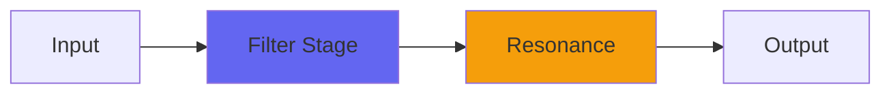

# Parametric

 

## Quick Info

| | |
|---|---|
| **Category** | Filter |
| **Type** | Filter |
| **Status** | Latest Release |

## Description

three bands of ConsoleX EQ in advance

## Detailed Overview

Parametric is basically 3/4 of the EQ section of ConsoleX, except that it's half of the EQ section because ConsoleX has a dedicated highpass and lowpass per channel (and a special one for the buss). Except that it's one third of the EQ section, because ConsoleX also has Stonefire per channel (and on the buss), but you actually already have Stonefire! So you can run that into this and begin to get a handle on what ConsoleX will allow.

Except you actually won't, because in ConsoleX proper, Stonefire is also a multiband compressor/gate (an extension of what you get in big SSL consoles) in which Parametric (like this, but with a dedicated bass filter) runs parallel around the Stonefire and dynamics. So in that, everything in Parametric will be used as ways of bringing energy and power AROUND the dynamics so the sound opens up way more than you'd get in a real SSL, and then you apply Discontinuity (which you also already have now) to set the overall loudness cues.

I promise I will explain all this when it's done. It seems I've been working real hard on all this and a lot happens and I'm sure it's a lot to keep up with. Them's the risks when you're trying to not imitate, but outdo the classics. For the time being, Parametric is roughly SSL-style EQ for very detailed tone shaping, in three bands designed to be recognizable to SSL fans except the Low Mid extends into the bass (so I could make sure Parametric works in Airwindows Consolidated, and in the VCV Rack version). The sound is Airwindows-style and I hope it's useful, but the ranges and resonances of the filters are designed to act something like a big SSL console so if you know to grab for the High Mid control and tighten the bandwidth by turning it left, this acts the same way without 'emulating' someone else's property.

## Signal Flow

## How It Works

Parametric shapes frequencies through filtering. Use it for tone shaping, problem solving, or creative sound design.

## Usage Tips

- Make small adjustments - EQ is powerful
- Cut first, boost second (if needed)
- Check your changes in context with the full mix
- Use solo to identify problem frequencies

## Related Plugins

Browse other [Filter](../categories/filter.md) plugins.

## Technical Details

**Source Code**: [View on GitHub](https://github.com/airwindows/airwindows/tree/master/plugins/LinuxVST/src/Parametric)

**Categories**: Filter

**Available Formats**:
- Mac AU
- Mac VST
- Windows VST
- Linux VST

## Resources

- [All Airwindows Plugins](../../README.md)
- [Category: Filter](../categories/filter.md)
- [Airwindows Website](https://www.airwindows.com)
- [Airwindows GitHub](https://github.com/airwindows/airwindows)

---

*Part of the Airwindows plugin collection - Open source audio processing plugins*

*Last updated: 2024*
