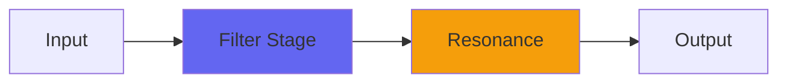

# Pear2

## Quick Info

| | |
|---|---|
| **Category** | Filter |
| **Type** | Filter |
| **Status** | Latest Release |

## Description

my Pear filter plus nonlinearity

## Detailed Overview

Turns out I got more use out of Pear than anybody else… until now.

Pear (as a plugin) is real experimental. It's got fixed cutoff points based on bit shifting, to see what that was like and whether it would maximize tone purity. Maybe it did (you've got it already so you're free to check it out). It's got a Poles control, but it's not meant to be a sweepy synth filter, it was purely an experiment on things I could do with the Holt algorithm.

Turns out you can have a lot more fun with it when you turn it loose.

Pear2 doesn't restrict the frequencies. In fact it smooths the control, specifically so you can sweep it. You can sweep everything except Poles: there's a switch on that, but you get to add WAY more poles than before.

And then there's the Nonlin control… and now it's time to get gnarly.

This doesn't have a distortion circuit! As filthy as it can get, none of that is from distortion or saturation. It's purely from the same nonlinearity calculation present in Capacitor2, in BiquadNonlin, and so on. That is applied here to a completely different algorithm based on Holt, and the more poles you add to the gnarly brew, the weirder it gets. You can use this for a really vibey analog-style EQ (high or low shelf: I'll be using it as a crossover) or you can push it until it's making a sound that has not been heard before.

So if you liked weirdness like the Y series filters, this is your new toy. Back next week with…

…more.

Yeah, let's just call it 'more' ;)

## Signal Flow

## How It Works

Pear2 shapes frequencies through filtering. Use it for tone shaping, problem solving, or creative sound design.

## Usage Tips

- Make small adjustments - EQ is powerful
- Cut first, boost second (if needed)
- Check your changes in context with the full mix
- Use solo to identify problem frequencies

## Related Plugins

Browse other [Filter](../categories/filter.md) plugins.

## Technical Details

**Source Code**: [View on GitHub](https://github.com/airwindows/airwindows/tree/master/plugins/LinuxVST/src/Pear2)

**Categories**: Filter

**Available Formats**:
- Mac AU
- Mac VST
- Windows VST
- Linux VST

## Resources

- [All Airwindows Plugins](../../README.md)
- [Category: Filter](../categories/filter.md)
- [Airwindows Website](https://www.airwindows.com)
- [Airwindows GitHub](https://github.com/airwindows/airwindows)

---

*Part of the Airwindows plugin collection - Open source audio processing plugins*

*Last updated: 2024*
