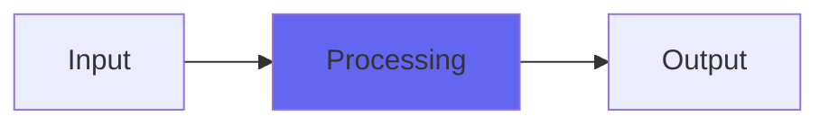

# PhaseNudge

## Quick Info

| | |
|---|---|
| **Category** | Subtlety |
| **Type** | Subtlety |
| **Status** | Latest Release |

## Description

a phase rotator/allpass filter

## Detailed Overview

Here’s a simple little utility plugin, Airwindows-ized. Except, it seems like this isn’t part of typical DAWs and plugin collections. Can’t see why, it’s a pretty basic tool.

In radio, there was the need for a phase rotator, to make waveforms more symmetrical for loudness maximizing. In reverbs, you get a thing called an allpass filter (a kind of feedback delay at a specific calibration) which diffuses the sound so it can be fed to delay banks and seem more spatial. Turns out these are the same basic thing! It’s also in phase shifters (mixing the phase-shifted part against dry, or inverse dry).

What happens? When you use an allpass filter, what you get is all the frequencies exactly as loud as they were before, but the phases of the frequencies are all different. Specifically, lows get delayed relative to the highs producing an effect where tones are ‘smeared’ across a time stretch, even though the spectral contents are exactly the same. The frequency information’s unaltered (nothing’s out of tune or darkened/brightened) but there’s a blur, possibly a large blur. PhaseNudge is set up to produce delays from really short (normal for a phase rotator) to unusually long, in case you’d like to treat it as a kind of slapback/echo effect.

The calibration of PhaseNudge is finer than you usually find in an allpass: 0.618 is the customary number but when I see that I think ‘golden ratio’, so that’s what PhaseNudge is using, to very high accuracy. Also, PhaseNudge uses a variation on the operating principle of Console to expand and deepen the sound. Though typical allpasses use very short delays, I think PhaseNudge does its thing quite well across a broad range of delays. Anywhere you need a ‘defocus’ or ‘blur’ plugin, PhaseNudge should come in handy, whether it’s diffuse pads, overly pointy percussive elements, or even the effects loop of a lead guitar sound (phase shifters have been used for decades, to make the textures of leads more fluid before they hit the actual amp. You’ve heard this on ‘Eruption’ and may not have even known it, because it’s very subtle there)

This is a real fundamental building-block tool in digital audio, and if DAW makers will not include it as part of standard equipment, I will. ;)

## Signal Flow

## How It Works

PhaseNudge processes audio in the Subtlety category. See the description above for specific functionality.

## Usage Tips

- Start with conservative settings
- A/B compare to hear the effect clearly
- Use in context with other processing
- Trust your ears over visual meters

## Related Plugins

Browse other [Subtlety](../categories/subtlety.md) plugins.

## Technical Details

**Source Code**: [View on GitHub](https://github.com/airwindows/airwindows/tree/master/plugins/LinuxVST/src/PhaseNudge)

**Categories**: Subtlety

**Available Formats**:
- Mac AU
- Mac VST
- Windows VST
- Linux VST

## Resources

- [All Airwindows Plugins](../../README.md)
- [Category: Subtlety](../categories/subtlety.md)
- [Airwindows Website](https://www.airwindows.com)
- [Airwindows GitHub](https://github.com/airwindows/airwindows)

---

*Part of the Airwindows plugin collection - Open source audio processing plugins*

*Last updated: 2024*
