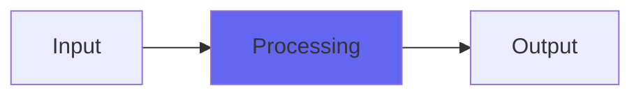

# PitchDelay

 

## Quick Info

| | |
|---|---|
| **Category** | Ambience |
| **Type** | Ambience |
| **Status** | Latest Release |

## Description

TapeDelay2 but with pitch shift instead of flutter

## Detailed Overview

So I was at a a synthesizer meet-up talking with some folks and someone asked me if I could do a particular thing. I’d mentioned how my TapeDelay2, which I was about to post that very night, would let you wiggle around the speed control and you’d get crazy wobble JUST like if you were doing it on a tape deck, because of the way I ran the delay buffers. And the request was to make a plugin where the time would wobble but the pitch would not, perhaps using some pitch shifter algorithm.

And… I did not make that thing! :D but I made this instead, and here you go!

All this is, is TapeDelay2 but instead of the flutter control, it’s got a fixed pitch shift. It’s being done in a more normal way than Glitch Shifter, but for all that it still enables some silly and extreme noises. Everything not flutter/pitch knob related, is exactly the same: all my development time went towards making the pitch shift interesting.

If you shift up, you can go towards very shrill crazy up-shifts that are right to the edge of blowing up the plugin. If you shift down, you can drop pitch down to literally nothing… and then keep going until you’re doing reverse buffer looping, which ends up (at a setting of 0) being the same pitch you started with, but backwards. Except it’s not playing the actual audio backwards, it’s cycling the algorithm backwards while the sound still plays ‘forwards’, so you get a ‘voice disguise’ effect. Sneak the setting just off the zero point, and it’s backwards low-speed, good for alien monster voices. If you include the regeneration while doing this you get a glorious mess. Also, the regeneration can be set to WAY more than just feedback, but it subtly restrains itself a bit so that you can hover around total feedback in a usable way. This combined with pitch shifting settings and the filter that comes with TapeDelay2 can give you a whole pile of strange, sorta-analogy noises without even putting more sounds in (it does require some sort of noise beyond digital black to start with, but once it’s going you’ll be able to play it like a weird instrument)

Add this to your Tape Delay arsenal. It’s not part of TapeDelay because it’s weird enough to be its own purpose (dedicated plugins for purposes is more or less my thing). Hope you like it :)

## Signal Flow

## How It Works

PitchDelay processes audio in the Ambience category. See the description above for specific functionality.

## Usage Tips

- Start with conservative settings
- A/B compare to hear the effect clearly
- Use in context with other processing
- Trust your ears over visual meters

## Related Plugins

Browse other [Ambience](../categories/ambience.md) plugins.

## Technical Details

**Source Code**: [View on GitHub](https://github.com/airwindows/airwindows/tree/master/plugins/LinuxVST/src/PitchDelay)

**Categories**: Ambience

**Available Formats**:
- Mac AU
- Mac VST
- Windows VST
- Linux VST

## Resources

- [All Airwindows Plugins](../../README.md)
- [Category: Ambience](../categories/ambience.md)
- [Airwindows Website](https://www.airwindows.com)
- [Airwindows GitHub](https://github.com/airwindows/airwindows)

---

*Part of the Airwindows plugin collection - Open source audio processing plugins*

*Last updated: 2024*
