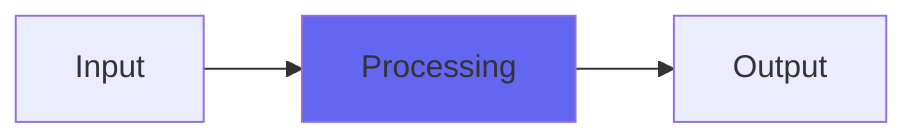

# Pockey

## Quick Info

| | |
|---|---|
| **Category** | Lo-Fi |
| **Type** | Lo-Fi |
| **Status** | Stable |

## Description

12 bit (and under) lo-fi hiphop in a plugin

## Detailed Overview

This plugin is designed to give you the most vibe possible out of a particular target: 12 bit uLaw-sampled lo-fi hiphop. It's based on earlier plugins like DeRez and BitGlitter, but is tailored to deliver just the right kind of warm fuzzy texture like an old sampler… or the Pocket Operator sampler that's a lot more accessible than retro 12-bit is.

Pockey uses uLaw encoding to stretch 12 bit sampling to where it sounds pretty nearly CD quality, except there's a whole vibe and texture you get through having the soft, delicate sounds slightly low-bit and the louder sounds even more crunchy than that. The lowest setting on the resolution slider is exactly 12 bit, and everything higher than that gives you progressively more lo-fi in an 'analog bitcrush' mode, meaning that it will gradually build as you turn it up, rather than jump from step to step. That way you can fade smoothly from 4-bit to 12, if you like.

The frequency crush effect is also special: it uses an edge-softening algorithm a little bit like PurestDrive, for the purpose of turning the harsh and grating frequency crush you'd normally get from a plugin, into something a little more resonant, more sonorous. It's still a sort of digital nasty, but steps way over in the direction of 'classic sampler digital nasty', again in a way that suits the more chill lo-fi genres. If you're looking to have it be as clean as possible, take your audio and explore in the very lowest settings of the frequency control for a spot that's minimally intrusive, or a digital-sampler overtone that works best with the sounds you're using. All the stuff near 0 ought to be well behaved. Then as you crank it up, you'll get rowdier digital artifacts, but always with that softening that helps lo-fi hiphop provide a soothing backdrop to life: which is partly due to the absence of super-extended frequencies grabbing your attention.

It's both an art and a science, and Pockey is there to help you find the art through me digging into the science of how these things are done :)

## Signal Flow

## How It Works

Pockey processes audio in the Lo-Fi category. See the description above for specific functionality.

## Usage Tips

- Start with conservative settings
- A/B compare to hear the effect clearly
- Use in context with other processing
- Trust your ears over visual meters

## Related Plugins

Browse other [Lo-Fi](../categories/lo-fi.md) plugins.

## Technical Details

**Source Code**: [View on GitHub](https://github.com/airwindows/airwindows/tree/master/plugins/LinuxVST/src/Pockey)

**Categories**: Lo-Fi

**Available Formats**:
- Mac AU
- Mac VST
- Windows VST
- Linux VST

## Resources

- [All Airwindows Plugins](../../README.md)
- [Category: Lo-Fi](../categories/lo-fi.md)
- [Airwindows Website](https://www.airwindows.com)
- [Airwindows GitHub](https://github.com/airwindows/airwindows)

---

*Part of the Airwindows plugin collection - Open source audio processing plugins*

*Last updated: 2024*
