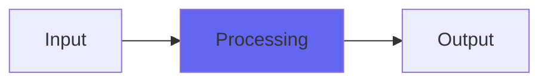

# Pockey2

 

## Quick Info

| | |
|---|---|
| **Category** | Lo-Fi |
| **Type** | Lo-Fi |
| **Status** | Latest Release |

## Description

more efficient, more intense lo-fi hiphop in a plugin

## Detailed Overview

So this is pretty rapid iteration. I'd been struggling with getting Pockey to willingly do 12 bit: the algorithm didn't seem to like it, even crashed when I tried to go for 16 bit. Turns out it was counting bit by bit in order to do the analog bitcrushing thing. And there was another way to do it… but then other things had to change… and then other ideas started to happen…

Suffice to say, it earned its new version number.

Pockey2 takes the basic concept of Pockey and brings in an entirely fresh character, while running way more efficiently. Instead of analog-style floating point bitcrushing, it's integer… but you'll find the difference between 5037 'stairsteps' and 5038 'stairsteps' will amount to about the same thing, just way more easy on the CPU. Still uLaw, still a big sampler-esque texture, now letting you go from 4 bit all the way to 16 bit at no CPU penalty. There's not a lot of point running 16 bit here as it's still uLaw, but in case you're looking for just the lightest possible 'sampler' touch on your 24 bit DAW track, you've got it.

Instead of analog-style floating point frequency crushing, that's integer too… which means the adjustability of the super-bright frequency crushing will be 'steppy', not allowing fine adjustments especially if the DAW's at 44.1k. But if you're running 96k, you get a much broader range of adjustment! And you get to frequency crush down way lower than before… and the tone! Another reason Pockey2 is a new version number is that, while the tone of the frequency crush on Pockey was interesting and vibey, the stuff you can do with the different-sounding Pockey2 is beyond belief. Experiment with the DeFreq control and see what you get. There's a little bit of the 'sweep the digital sampler cutoff point' still there, especially at deeper frequency crushes, but Pockey2 shines when finding just the right spot to entirely transform a sound into pure lo-fi hip hop classic sampler madness. Even more than the original Pockey, this one can completely transform a sound into retro digital.

You can use both. If you like Pockey and find its CPU use too heavy, DeRez it more, it struggles to get to high bit depths. If you like Pockey2, it doesn't struggle with anything except sometimes with slowly sweeping a frequency crush way up high. I hope you like both Pockeys and find your best use for them :)

## Signal Flow

## How It Works

Pockey2 processes audio in the Lo-Fi category. See the description above for specific functionality.

## Usage Tips

- Start with conservative settings
- A/B compare to hear the effect clearly
- Use in context with other processing
- Trust your ears over visual meters

## Related Plugins

Browse other [Lo-Fi](../categories/lo-fi.md) plugins.

## Technical Details

**Source Code**: [View on GitHub](https://github.com/airwindows/airwindows/tree/master/plugins/LinuxVST/src/Pockey2)

**Categories**: Lo-Fi

**Available Formats**:
- Mac AU
- Mac VST
- Windows VST
- Linux VST

## Resources

- [All Airwindows Plugins](../../README.md)
- [Category: Lo-Fi](../categories/lo-fi.md)
- [Airwindows Website](https://www.airwindows.com)
- [Airwindows GitHub](https://github.com/airwindows/airwindows)

---

*Part of the Airwindows plugin collection - Open source audio processing plugins*

*Last updated: 2024*
