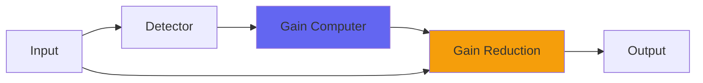

# Podcast

## Quick Info

| | |
|---|---|
| **Category** | Dynamics |
| **Type** | Dynamics |
| **Status** | Latest Release |

## Description

a simpler pile of curve-style compressors with hard clipping

## Detailed Overview

Podcast is the same technique as PodcastDeluxe, multiple compressors that are the precursor to curve and Recurve, but simplified: without the phase rotators, without the full-on attempt to do ‘radio broadcast’ style tricks.

This also means Podcast can have a dry/wet control, because there aren’t any phase rotations delaying things. In fact, Podcast runs no latency and can work very well as a ‘glue’ style buss compressor… so long as you don’t want ‘pumping and swelling’ effects, or sidechainy whooshes of level. That’s because Podcast is still in the curve school of compressors and quits changing levels if the input goes silent.

It also hard-clips the output, making it a kind of ‘safety compressor’: though it’s not clean like a limiter, it’ll strike a balance between dynamics processor and distortion device. You can use it on drums and things meant to be aggressively smashed, or turn it way down and use it as a clean buss comp.

Treat this as another flavor of compressor from Airwindows, and see if it finds uses for you. The greater simplicity of Podcast (much like PodcastDeluxe, heavily updated from the original versions) makes it more adaptable to different purposes, while it remains simple and un-fiddly, delivering its effects with whatever intensity and blend you like. :)

## Signal Flow

## How It Works

Podcast controls dynamics through peak control. The algorithm responds to your audio in a musical way, providing transparent to aggressive dynamic control.

## Usage Tips

- Start with gentle settings and increase as needed
- Use Dry/Wet for parallel compression if available
- Listen for pumping or artifacts
- A/B bypass to check if processing helps the mix

## Related Plugins

Browse other [Dynamics](../categories/dynamics.md) plugins.

## Technical Details

**Source Code**: [View on GitHub](https://github.com/airwindows/airwindows/tree/master/plugins/LinuxVST/src/Podcast)

**Categories**: Dynamics

**Available Formats**:
- Mac AU
- Mac VST
- Windows VST
- Linux VST

## Resources

- [All Airwindows Plugins](../../README.md)
- [Category: Dynamics](../categories/dynamics.md)
- [Airwindows Website](https://www.airwindows.com)
- [Airwindows GitHub](https://github.com/airwindows/airwindows)

---

*Part of the Airwindows plugin collection - Open source audio processing plugins*

*Last updated: 2024*
